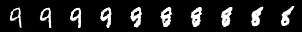

# GAN-MNIST

基于 `DCGAN` 生成手写数字。

## 模型

基于 `torchsummary` 生成：

### Generator
```
----------------------------------------------------------------
        Layer (type)               Output Shape         Param #
================================================================
            Linear-1                 [-1, 1024]         103,424
       BatchNorm1d-2                 [-1, 1024]           2,048
              ReLU-3                 [-1, 1024]               0
            Linear-4                 [-1, 6272]       6,428,800
       BatchNorm1d-5                 [-1, 6272]          12,544
              ReLU-6                 [-1, 6272]               0
   ConvTranspose2d-7           [-1, 64, 14, 14]         131,136
       BatchNorm2d-8           [-1, 64, 14, 14]             128
              ReLU-9           [-1, 64, 14, 14]               0
  ConvTranspose2d-10            [-1, 1, 28, 28]           1,025
          Sigmoid-11            [-1, 1, 28, 28]               0
================================================================
```

### Discriminator
```
----------------------------------------------------------------
        Layer (type)               Output Shape         Param #
================================================================
            Conv2d-1           [-1, 32, 24, 24]             832
         LeakyReLU-2           [-1, 32, 24, 24]               0
         MaxPool2d-3           [-1, 32, 12, 12]               0
            Conv2d-4             [-1, 64, 8, 8]          51,264
         LeakyReLU-5             [-1, 64, 8, 8]               0
         MaxPool2d-6             [-1, 64, 4, 4]               0
            Linear-7                 [-1, 1024]       1,049,600
         LeakyReLU-8                 [-1, 1024]               0
            Linear-9                    [-1, 1]           1,025
          Sigmoid-10                    [-1, 1]               0
================================================================
```

## 结果

<table>
    <tr>
        <td>Epoch</td>
        <td>生成效果</td>
    </tr> 
    <tr>
        <td>1</td>
        <td></td>
    </tr> 
    <tr>
        <td>5</td>
        <td></td>
    </tr> 
    <tr>
        <td>20</td>
        <td></td>
    </tr> 
    <tr>
        <td>50</td>
        <td></td>
    </tr> 
</table>

## 插值

很有趣的一点是，GAN 是给一个分布输出一个分布。假如说输入的向量是 `a`，得到数字 9，再输入一个向量 `b`，得到数字 8。
如果你在两个向量之间做插值，一个个输入模型，你将会观察到从 9 转变成 8 的过程！

以下是一些例子：

<table>
    <tr>
        <td>转变</td>
        <td>插值图</td>
    </tr> 
    <tr>
        <td>9 -> 8</td>
        <td></td>
    </tr> 
    <tr>
        <td>3 -> 0</td>
        <td></td>
    </tr> 
    <tr>
        <td>3 -> 8 -> 0</td>
        <td></td>
    </tr> 
    <tr>
        <td>9 -> 4</td>
        <td></td>
    </tr> 
</table>