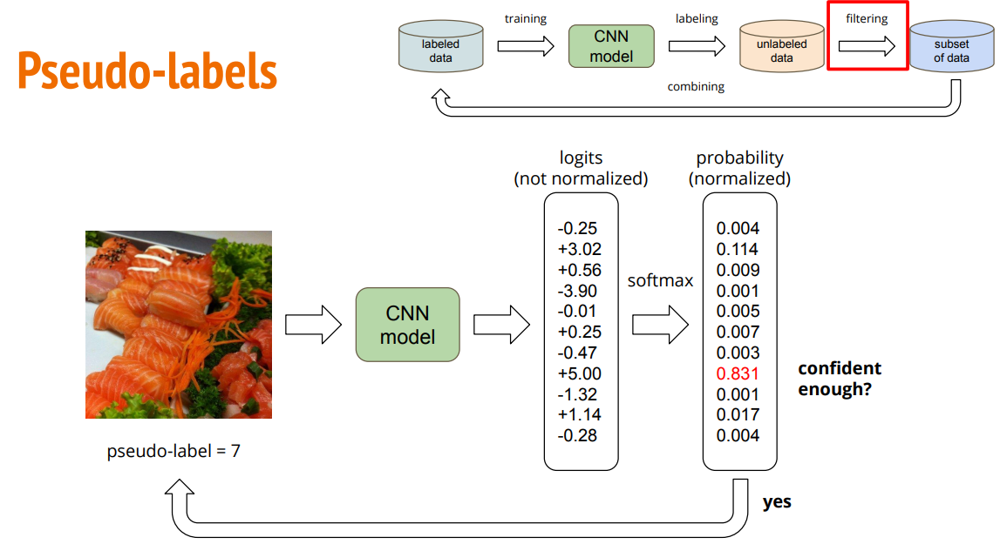

# HW 3

作业链接：[ML2021Spring-hw1](https://www.kaggle.com/competitions/ml2021spring-hw3)

推荐 Notebook：https://github.com/1am9trash/Hung_Yi_Lee_ML_2021/blob/main/hw/hw3/hw3_code.ipynb


## Cross Validation

即采用 K-折交叉验证，将训练集（train + val）分为 K 份，训练 K 次，每次取其中一份作为验证集，剩余 K-1 份作为训练集。

注意：每一折的训练都是独立的，也就是说会训练 K 个模型，假如说原先是训练 num_epoch 次，现在就会需要训练 K × num_epoch 次。最后从 K 个模型中选取最好的那个作为结果。 

+ `torch.utils.data.Subset` 获取子数据集：

+ `torch.utils.data.ConcatDataset` 合并数据集：

## Augmentation

图像分类训练技巧之数据增强篇：https://zhuanlan.zhihu.com/p/430563265

本作业中我做的一些数据增强：

<figure class="half">
    
    
</figure>

### 基于 `torchvision.transfroms`

文档：https://pytorch.org/vision/stable/transforms.html#scriptable-transforms

参考博客：https://blog.csdn.net/weixin_44575152/article/details/123779647

### AutoAugment

论文链接：https://arxiv.org/abs/1805.09501

> 谷歌在2018年提出通过AutoML来自动搜索数据增强策略，称之为AutoAugment（算是自动数据增强开山之作）。
搜索方法采用强化学习，和NAS类似，只不过搜索空间是数据增强策略，而不是网络架构。
在搜索空间里，一个policy包含5个sub-policies，每个sub-policy包含两个串行的图像增强操作，
每个增强操作有两个超参数：进行该操作的概率和图像增强的幅度（magnitude，这个表示数据增强的强度，比如对于旋转，旋转的角度就是增强幅度，旋转角度越大，增强越大）。
每个policy在执行时，首先随机从5个策略中随机选择一个sub-policy，然后序列执行两个图像操作。

```python
from torchvision.transforms import autoaugment, transforms

train_transform = transforms.Compose([
    transforms.RandomResizedCrop(crop_size, interpolation=interpolation),
    transforms.RandomHorizontalFlip(hflip_prob),
    # 这里 policy 属于 torchvision.transforms.autoaugment.AutoAugmentPolicy，
    # 对于 ImageNet 就是 AutoAugmentPolicy.IMAGENET
    # 此时 aa_policy = autoaugment.AutoAugmentPolicy('imagenet')
    autoaugment.AutoAugment(policy=aa_policy, interpolation=interpolation),
 transforms.PILToTensor(),
    transforms.ConvertImageDtype(torch.float),
    transforms.Normalize(mean=mean, std=std)
 ])
```

> 一个比较重要的问题，这些从某一个数据集搜索得到的策略是否只对固定的数据集有效，论文也通过具体实验证明了AutoAugment的迁移能力，比如将ImageNet数据集上得到的策略用在5个 FGVC数据集（与ImageNet图像输入大小相似）也均有提升。 ​

一些

### Mixup

两张不同的图像随机线性组合，而同时生成线性组合的标签。


论文链接：https://arxiv.org/abs/1710.09412

文章：https://zhuanlan.zhihu.com/p/430563265

## Label Smoothing

传统 `one-hot` 编码标签的网络学习过程中，鼓励模型预测为目标类别的概率趋近1，
非目标类别的概率趋近0，即最终预测的 `logits` 向量（`logits` 向量经过 `softmax` 后输出的就是预测的所有类别的概率分布）中目标类别的值会趋于无穷大，
使得模型向预测正确与错误标签的 `logits` 差值无限增大的方向学习，而过大的 `logits` 差值会使模型缺乏适应性，对它的预测过于自信。
在训练数据不足以覆盖所有情况下，这就会导致网络过拟合，泛化能力差，而且实际上有些标注数据不一定准确，这时候使用交叉熵损失函数作为目标函数也不一定是最优的了。

## Soft Label vs Hard Label


### Test Time Augmentation

参考资料：https://blog.51cto.com/u_15699099/5420932

测试时数据增强。在测试时，将图片进行增强（利用 transform）生成多份，然后输入训练好的模型，输出多个结果（结果集合）。然后对所有的结果取平均，作为最终结果。

其实拟人化地讲，就是让训练好的模型看到更多角度的图片（因为进行了多种变换），对这些多角度一一进行评估，将所有评估结果取平均作为最终预测结果。这样的结果会更加准确和稳定。

因为输入的图片可能恰好涉及训好模型的盲区，而变换之后说不定就能达到更好预测结果。

见这个例子：https://www.kaggle.com/code/andrewkh/test-time-augmentation-tta-worth-it/notebook

## Semi Supervised
半监督学习。




## 遇到的一些坑

+ `transforms.RandomChoice` 等变换（见上面那篇博客）只能用于 `PIL` 格式，应该先用 `transforms.ToPILImage()` 转换。
+ `transforms.RandomErasing` 等变换（见上面那篇博客）只能用于 `Tensor` 格式，应该先用 `transforms.ToTensor()` 转换。
+ Tensor(H×W×C) 使用 cv2.imwrite / cv2.imshow:
    
    ```python
    img = img.numpy().transpose((1, 2, 0))
    cv2.imwrite("img.png", img*255)
    ```
  
## 用到的技巧

+ one-hot: torch.nn.functional.one_hot(target, num_classes=self.num_classes)

+ 当神经网络深度逐渐增加，网络参数量增多的时候，反向传播过程中链式法则里的梯度连乘项数便会增多，更易引起梯度消失和梯度爆炸。对于梯度爆炸问题，解决方法之一便是进行梯度剪裁，即设置一个梯度大小的上限。
    
    pytorch 中梯度剪裁方法为 torch.nn.utils.clip_grad_norm_(parameters, max_norm, norm_type=2)
    
    三个参数：

    + parameters：希望实施梯度裁剪的可迭代网络参数
    + max_norm：该组网络参数梯度的范数上限
    + norm_type：范数类型

+ 如何使用 `Resnet` 预训练模型并修改最后的连接层以满足我们的需求？
    
    ```python
    import torchvision.models
      
    model = models.resnet18(pretrained=True).to(device)
    num_ftrs = model.fc.in_features
    model.fc = nn.Linear(num_ftrs, num_classes).to(device)
    model.device = device
    ```
+ 合并数据集：

    ```python
    torch.utils.data.ConcatDataset([dataset1, dataset2])
    ```

+ 获取子数据集：

    ```python
    torch.utils.data.Subset(dataset, indices)
    ```
    其中 `indices` 代表 [1, 2, ...] 这样的序列。

# TODO-list
+ [ ] Focal loss
