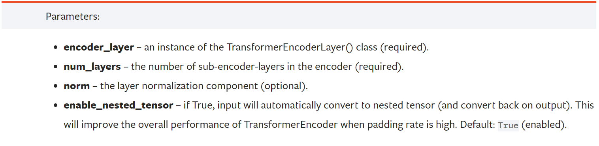

# hw4

作业链接：https://www.kaggle.com/competitions/ml2021spring-hw4


## 特征提取


## 使用 Transformer Encoder

```python
self.encoder_layer = nn.TransformerEncoderLayer(d_model=d_model, dim_feedforward=256, nhead=1)
self.encoder = nn.TransformerEncoder(self.encoder_layer, num_layers=2)
```
### nn.TransformerEncoderLayer


其中 `dim_feedforward` 对应于 `Encoder` 中的 `Feed Forward` 层的维度，其作用是进一步提取深层信息。


> `Multi-Head Attention` 的输出做了残差连接和 `Norm` 之后得数据，然后 `Feed Forward` 做了两次线性线性变换，为的是更加深入的提取特征。

### nn.TransformerEncoder



## 自定义 LR scheduler

使用 `torch.optim.lr_scheduler.LambdaLR`


## Conformer
