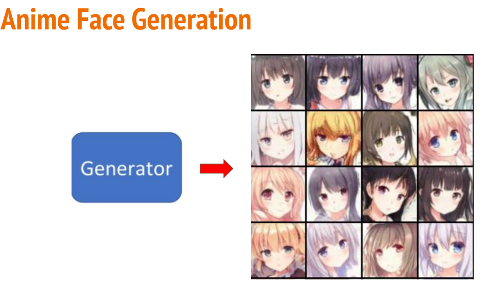
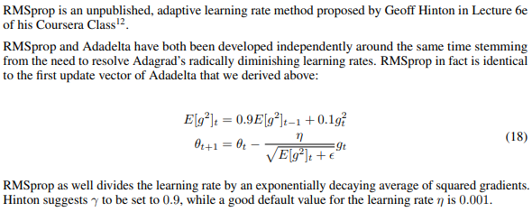
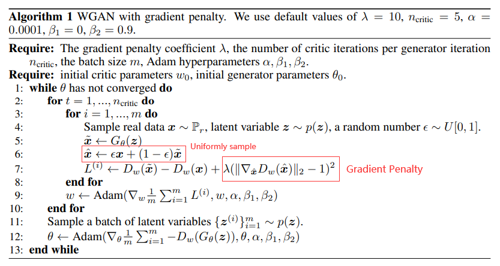
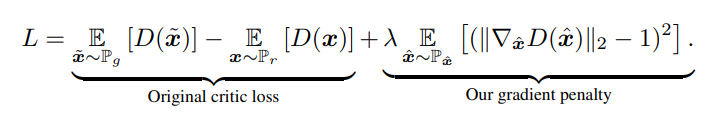
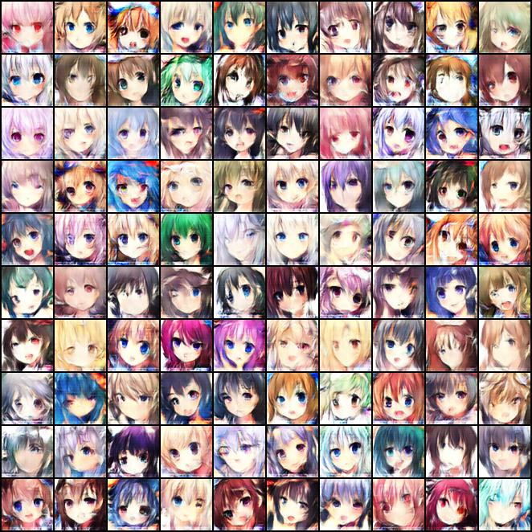
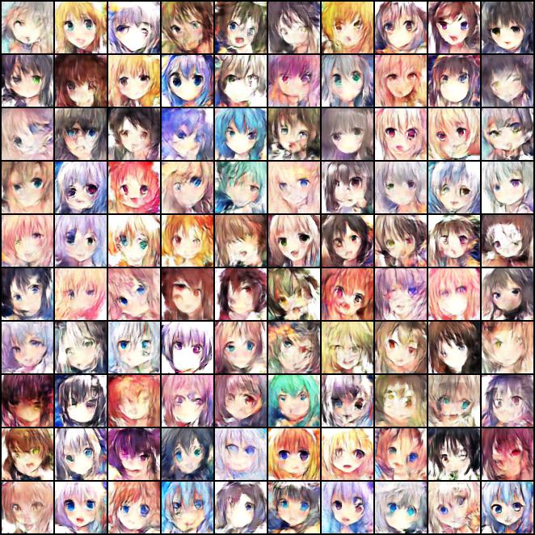
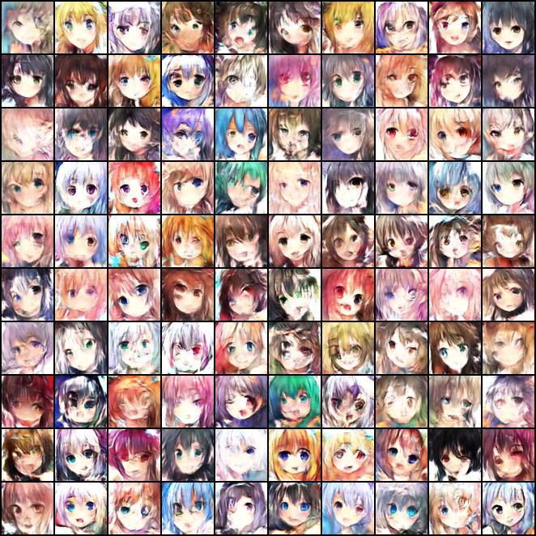
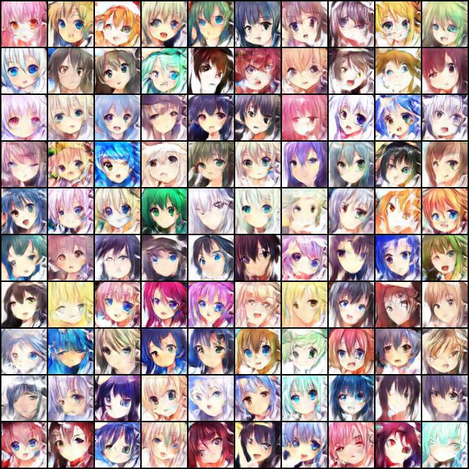

# hw6



## WGAN

https://arxiv.org/abs/1701.07875

参考链接：https://zhuanlan.zhihu.com/p/539156191

+ 原理
  
    `WGAN` 的 `Discriminator` 本质上就是要去拟合这样的一个 `Wasserstein Distance`。
    原先的 `GAN` 的 `Discriminator` 是在模拟 JS 散度，是一个分类问题。而 `WGAN` 则变成了一个回归问题，
    故而需要去掉最后的 `Sigmoid` 层。

+ 优化器选择 `RMSProp`

    之所以不用 `Adam` 是因为 loss 不稳定，冲量会加剧这一不稳定性。
    
    > RMSProp采用了指数加权移动平均(exponentially weighted moving average)。
    >
    > RMSProp比AdaGrad只多了一个超参数，其作用类似于动量(momentum)，其值通常置为0.9。
    >
    > RMSProp旨在加速优化过程，例如减少达到最优值所需的迭代次数，或提高优化算法的能力，例如获得更好的最终结果。

    
    
+ 损失函数

    回归问题：
    
    ```python
    loss_G = -torch.mean(D(f_imgs))
    ```
    
+ Parameter Clipping

    `WGAN` 希望拟合出来的函数是满足 `1-Lipschitz` 条件的，也就是函数需要足够光滑。
    
    利用 `Clipping` 去近似这种光滑：限制参数的数值范围在 [-c, c] 之间，其中 `c` 是一个常数。
    

## WGAN-GP

https://arxiv.org/abs/1704.00028 

将较为粗糙的 `Clipping` 换为一个梯度的惩罚（类似于正则化）。会在生成的 $\hat{x}$ 和真实的 $x$ 之前采样一个 $\tilde{x}$，计算它的梯度，并得到对应的惩罚值（梯度越接近 1，这种惩罚值越低）。因为 `1-Lipschitz` 条件也就是在说函数任意一点的梯度不能超过 1，但我们不可能把每一个点都考虑进去，所以是采样一个点，
对其做 `Gradient Penalty`。

Pytorch 实现（链接：https://blog.csdn.net/junbaba_/article/details/106185743 ）：
```python
def cal_gradient_penalty(disc_net, device, real, fake):
    """
    用于计算WGAN-GP引入的gradient penalty
    """
    # 系数alpha
    alpha = random.random()
    
    # 按公式计算x
    interpolates = alpha * real + ((1 - alpha) * fake)

    # 为得到梯度先计算y
    interpolates = interpolates.to(device)
    interpolates.requires_grad = True
    disc_interpolates = disc_net(interpolates)

    # 计算梯度
    gradients = autograd.grad(outputs=disc_interpolates, inputs=interpolates,
                              grad_outputs=torch.ones(disc_interpolates.size()).to(device),
                              create_graph=True, retain_graph=True, only_inputs=True)[0]

    # 利用梯度计算出gradient penalty
    gradient_penalty = ((gradients.norm(2, dim=1) - 1) ** 2).mean()
    return gradient_penalty

elif opt.model == 'wgan-gp':
    # WGAN-GP此处与WGAN同
    D_Loss_real = disc_net(real_img).mean()
    fake = gen_net(noise)
    D_Loss_fake = disc_net(fake).mean()
    # WGAN-GP相较于WGAN引入了gradient penalty限制梯度
    gradient_penalty = cal_gradient_penalty(disc_net, device, real_img.data, fake.data)
    D_Loss = -(D_Loss_real - D_Loss_fake) + gradient_penalty * 0.1
    # 反向传播
    D_Loss.backward()
```




损失函数：



## 效果

AFD: Anime Face Detect

FID: 见 [GAN](../../notes/GAN.md)

<table>
    <tr>
        <td>模型</td>
        <td>epoch = 50</td>
        <td>结果</td>
        <td>epochs</td>
    </tr>
    <tr>
        <td>DCGAN</td>
        <td></td>
        <td><a href="DCGAN-result.jpg">DCGAN-result.jpg</a></td>
        <td>50</td>
    </tr>
    <tr>
        <td>DCGAN</td>
        <td></td>
        <td><a href="DCGAN_result2.jpg">DCGAN_result2.jpg</a></td>
        <td>200</td>
    </tr>
    <tr>
        <td>WGAN</td>
        <td></td>
        <td><a href="WGAN-result.jpg">WGAN-result.jpg</a></td>
        <td>50</td>
    </tr>
    <tr>
        <td>WGAN</td>
        <td></td>
        <td><a href="WGAN-result2.jpg">WGAN-result2.jpg</a></td>
        <td>200</td>
    </tr>
    <tr>
        <td>WGAN-GP</td>
        <td></td>
        <td><a href="WGAN-GP-result.jpg">WGAN-GP-result.jpg</a></td>
        <td>200</td>
    </tr>
</table>
