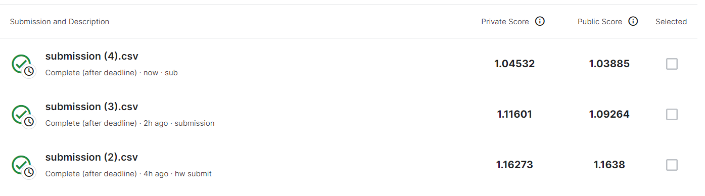

# HW 1

作业链接：[ML2021Spring-hw1](https://www.kaggle.com/competitions/ml2021spring-hw1)

作业所需的训练和测试集：[data](https://www.kaggle.com/competitions/ml2021spring-hw1/data)

## 特征提取

数据集中给了很多特征，但是有些是相对无用的特征，比如地理位置，需要利用 `sklearn.feature_selection.SelectKBest` 找到最重要的特征

注意需要对特征进行归一化。

## 模型

## 提交

+ 达到 `strong baseline`:
    
    
    

    
    