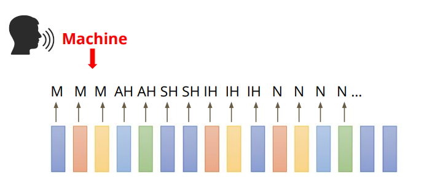
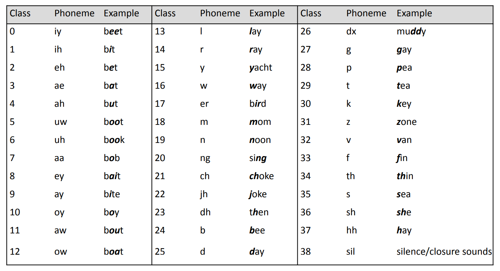
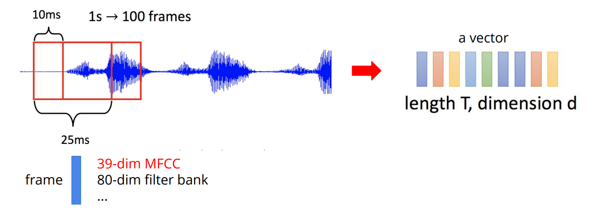
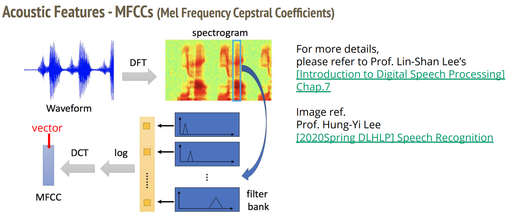

# HW2

作业链接：[ML2021Spring-hw2](https://www.kaggle.com/c/ml2021spring-hw2)

该作业是一个分类问题，需要将音频转换成对应的 `phoneme`（音位）。

phoneme 表：

> What is a phoneme?
>
> A unit of speech sound in a language that can serve to distinguish one word from the
other.
> + bat / pat , bad / bed
> + Machine Learning → <u>M AH SH IH N</u> <u>L ER N IH NG</u>

## 音频特征提取

通常我们会以 `25ms` 为窗口大小，`10ms` 为步长进行采样。采样得到的 `25ms` 的音频被称作一帧（`frame`）。

音频特征常用的有两种，`filter bank` 和 `MFCC`，该作业用的是 `MFCC`：

关于更多音频特征提取的知识，可以看这篇博客：[使用Python对音频进行特征提取](https://juejin.cn/post/6844903929101156365)

## todo-list
+ [ ] HMM-GMM 