# Auto-encoder

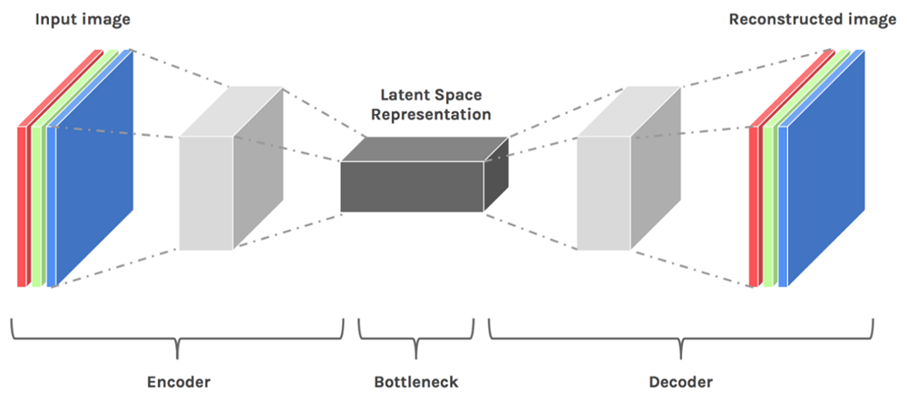

## Image

训练一个 `Encoder` 和 `Decoder`：
+ `Encoder` 将图像这样高维度的信息压缩为一个低维度的向量（Dimension Reduction）。
+ `Decoder` 将这个低维度的向量重新复原为原始图像。

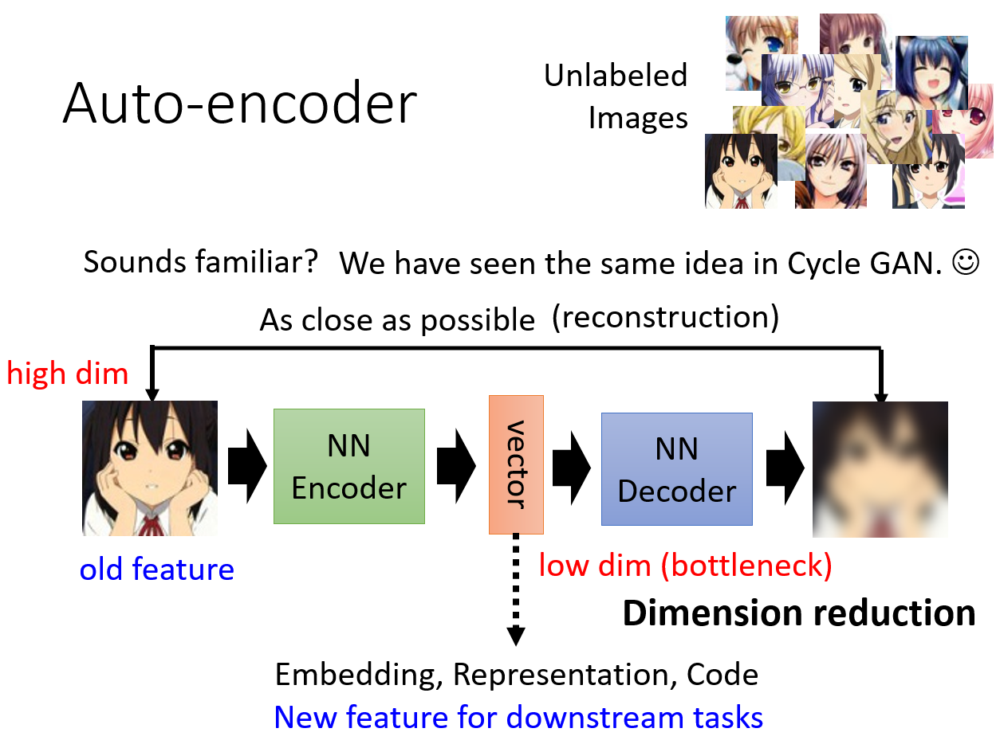

### 为什么这种方法行之有效？

为什么我们能够将一个高维度的图像信息压缩为一个很低维度的向量？因为对于图像而言，绝大多数都是无意义的噪声，
就像你随机生成一个灰度图的二维矩阵，大概率得到的是一堆噪音。而真正有意义的图像其实只占极少的比例。

以 3x3 的图像举例，在这么小的图像里，可能只有两种布局是有意义的，那么 `Encoder` 完全可以输出一个二维的向量，
代表这两种情况。

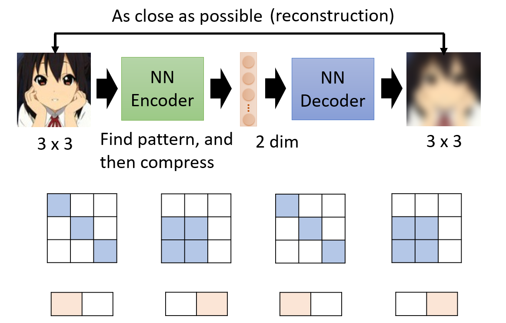

也就是说，在图像这样的极高维空间中，真正有意义的图像只占很小的空间，我们可以用压缩的信息（类似于 Word Embedding）将它们尽可能表示出来 。

## De-noising Auto-encoder

`BERT` 的预训练也用到了去噪自编码器的思想。

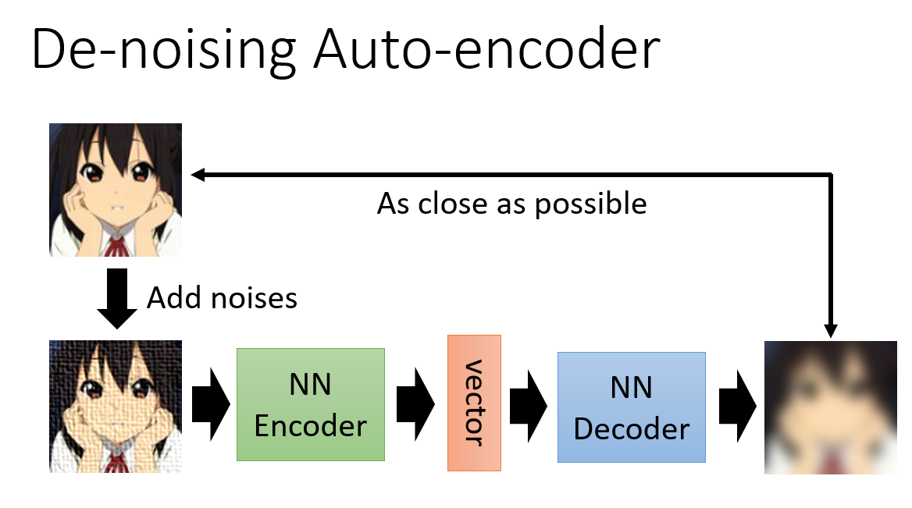

## Feature Disentangle

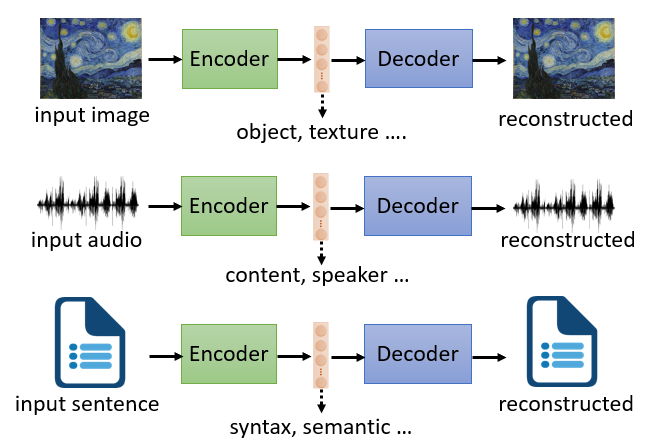

Encoder 虽然能够将多种特征，信息提取成一个向量，但是我们无法知道向量中哪个维度对应了什么。`Feature Disentangle` 就是要去解决这个问题。

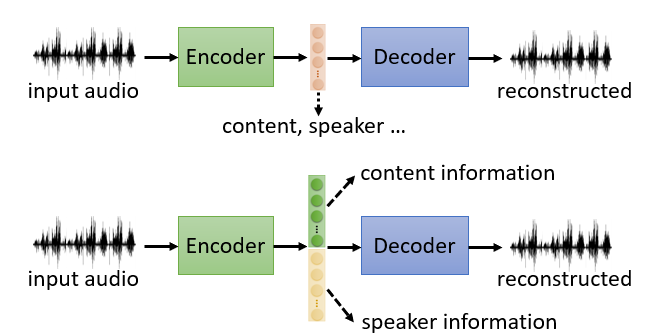

### 应用：Voice Conversion

既然我们可以用 `Feature Disentangle` 来了解哪些维度对应了声音的特征，哪些维度对应了声音的内容，
那我们就可以选择对应声音的特征的维度进行声音的替换（保持声音内容的维度不变，将声音特征的部分替换成新垣结衣的）。

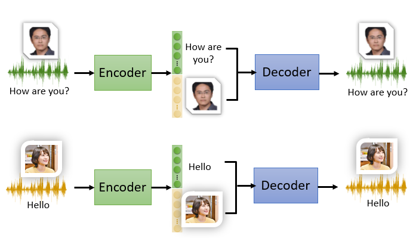

## Discrete Latent Representation

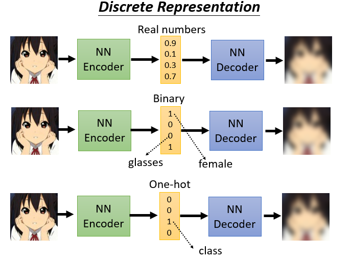

## Text as Representation

尝试让 `Encoder` 生成摘要（既然 `Decoder` 能够将其还原，说明 `Encoder` 生成的东西代表了文章的核心和精华内容）。 

和 `CycleGAN` 一样。如果不使用 `Discriminator` 会导致这个摘要完全不可读（`Encoder` 和 `Decoder` 在加密通话）

## Generator(what VAE does)

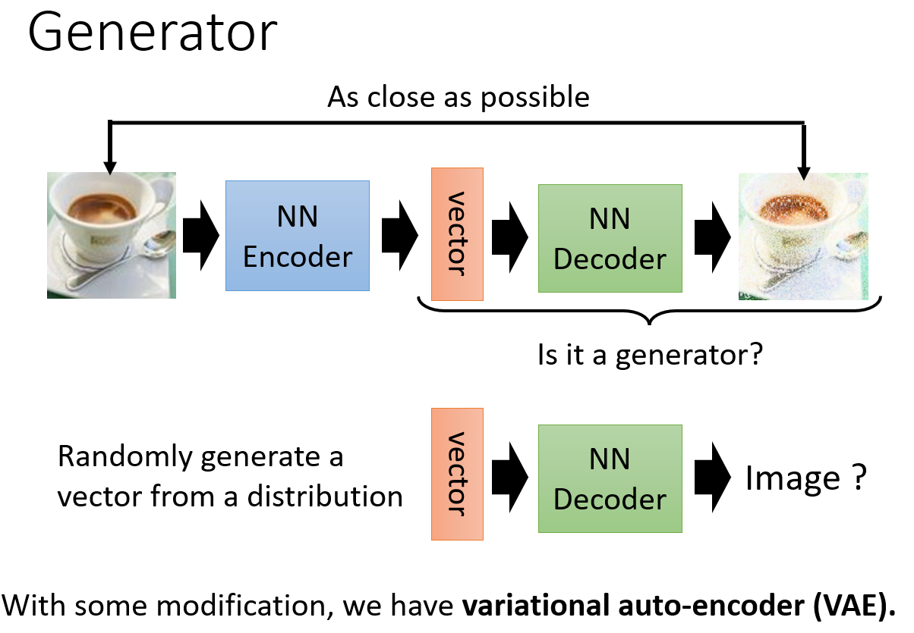
 
## Compression

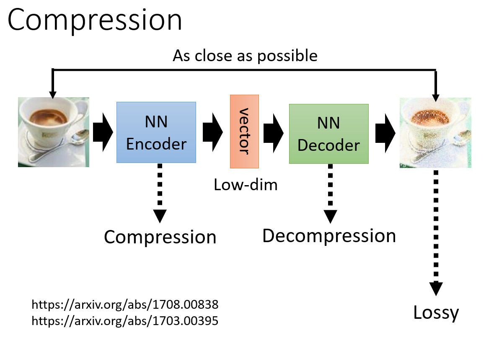

## Anomaly Detection（异常检测）

异常检测是一个 `One-class` 的分类问题，数据集是极度不对称的：你有大量正常的数据，和极少数不正常的数据，甚至你不知道不正常的数据长什么样，
这时候你要怎么训练？这不是一个一般的分类问题，需要用 `Auto-encoder` 来进行解决。

判断是否能够重构：

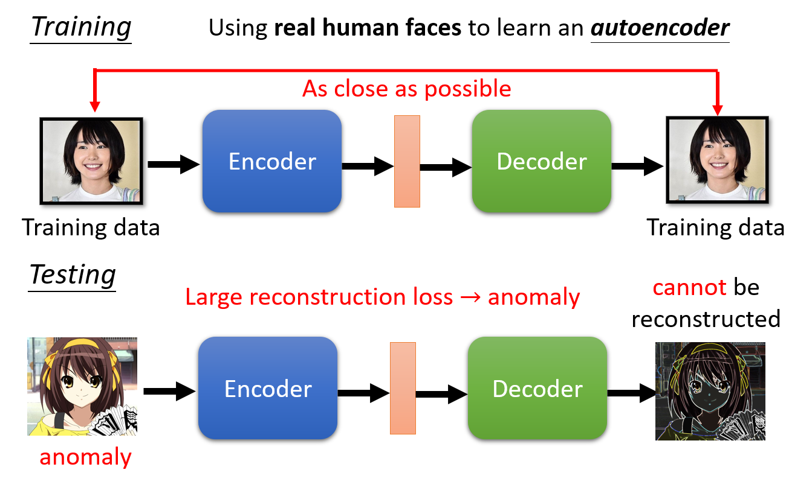