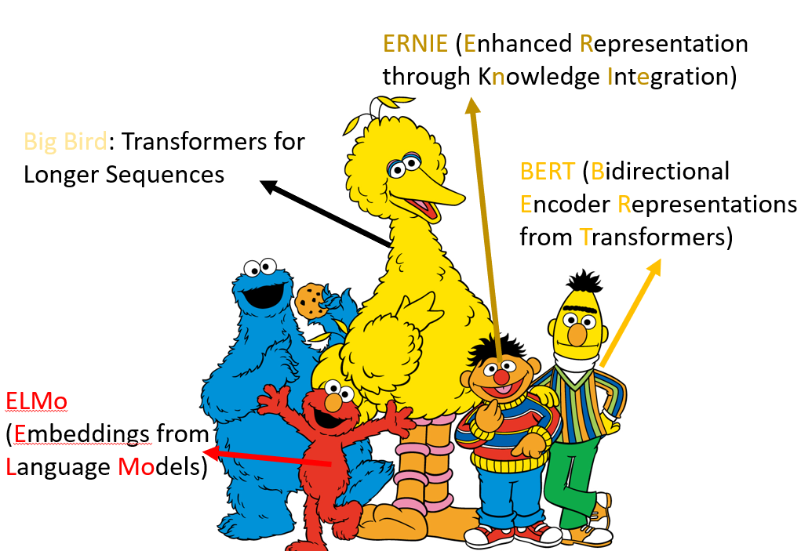
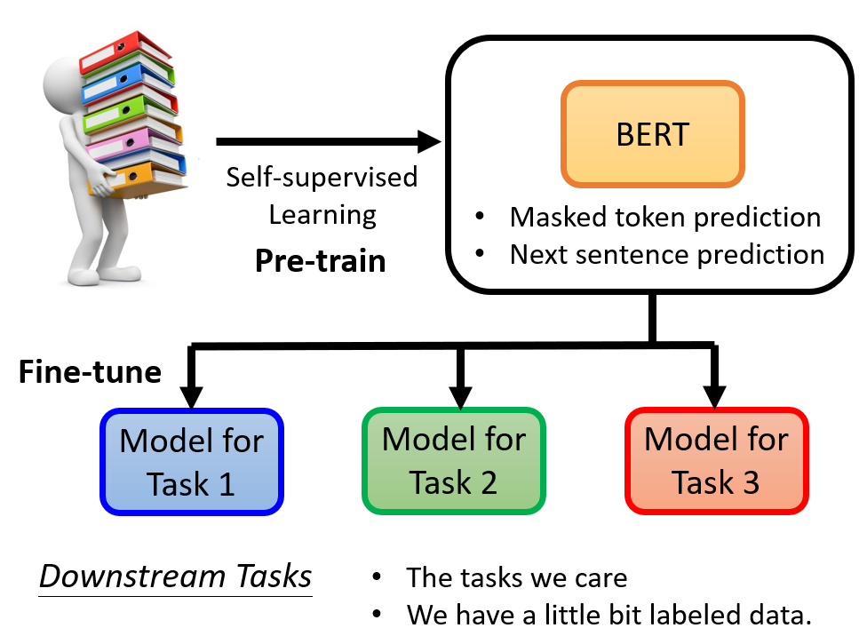
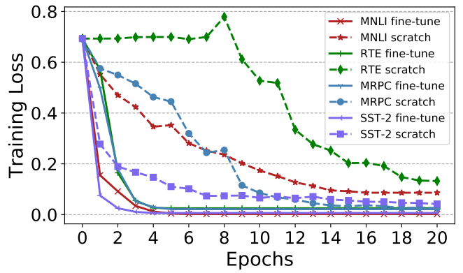
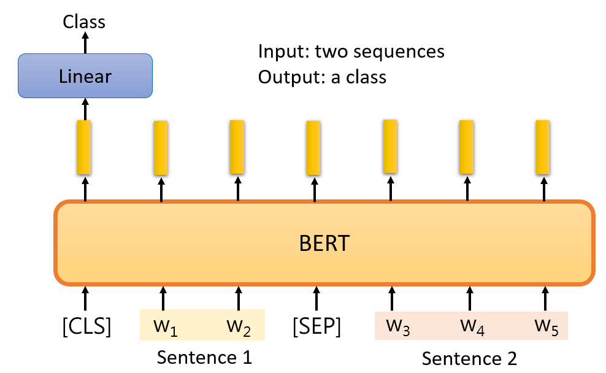
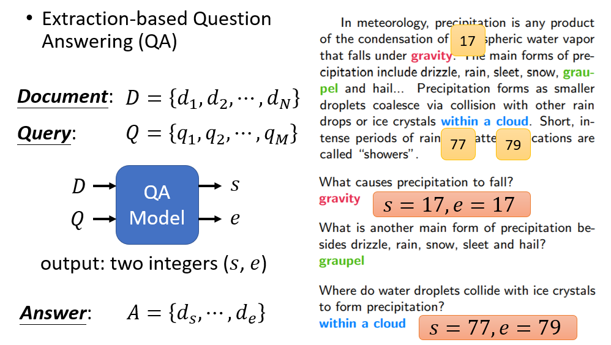

# BERT
芝麻街大家族。

自监督学习。

`BERT` 对应于 `Transformer` 的 `Encoder` 部分。 

## Masking Input

https://arxiv.org/abs/1810.04805

在给 `BERT` 数据的时候，将若干字替换成一个特殊的 `token`，或者随机的值。两种方式随机选择一种。

前面提到过，`BERT` 即是 `Encoder`，会输出一个向量的序列。 将这个向量经过一个线性层 + `softmax` 就可以得到遮住的字的概率分布。
我们既然已经知道“台”后面的字是“湾”，也就是说我们有标签，自然就可以用交叉熵作为损失函数训练咯~

这也就是“自己出题，自己回答”。

## Next Sentence Prediction 

`SEP` 区分两个句子。

这边只看 `CLS` 对应的输出，经过线性变换，做一个二元分类问题（Yes/No），即判断两个句子是不是相邻的。

## BERT 学到了什么？

`BERT` 实际上学到了如何做填空题。

先预训练，然后在微调以适应不同的任务。就像一个干细胞，可以分化成任何人体细胞。

`BERT` 本身是无监督的（自己出填空题，自己学着做），但是其下游任务（downstream task）可能是监督学习的。比如语句情感分类，利用之前学习填空题 pretrain
过的 `BERT` 模型，将其输出经过另一个网络（这个网络是需要投喂数据集监督学习的），最终输出情感分类。

pretrain 过的 `BERT` 会比随机参数的好。All you need is **fine-tuning!**

对于词性识别，流程也是类似的。生成的每个向量都通过一个待训练网络，剩下的和上面的例子一样。

判断假设和推断是否矛盾：

输入文章和问题，返回两个整数（答案的起止位置）：

和自注意力机制类似，橙色部分类似于一个 `Query`，去查询 `document` 中的每一个 `Key`，最终经过 `softmax` 的到最大概率的作为 start。
这边 s = 2。

还有一个蓝色的向量需要学习，对应于 end。和 start 类似，这边求出 e = 3。于是我们得出了答案的范围。

注意橙色和蓝色向量都是要训练的对象。

## Training BERT is challenging

训练 `BERT` 需要极大的数据量和极强的硬件。

## 预训练 Seq2Seq

类似的，也可以预训练 `Decoder`。将一些句子破坏掉（原始句子作为标签），进行 `self-supervise`

