# BERT

https://arxiv.org/abs/1810.04805v2

> BERT是2018年10月由Google AI研究院提出的一种预训练模型。BERT的全称是Bidirectional Encoder Representation from Transformers。BERT在机器阅读理解顶级水平测试SQuAD1.1中表现出惊人的成绩: 全部两个衡量指标上全面超越人类，并且在11种不同NLP测试中创出SOTA表现，包括将GLUE基准推高至80.4% (绝对改进7.6%)，MultiNLI准确度达到86.7% (绝对改进5.6%)，成为NLP发展史上的里程碑式的模型成就。

芝麻街大家族。

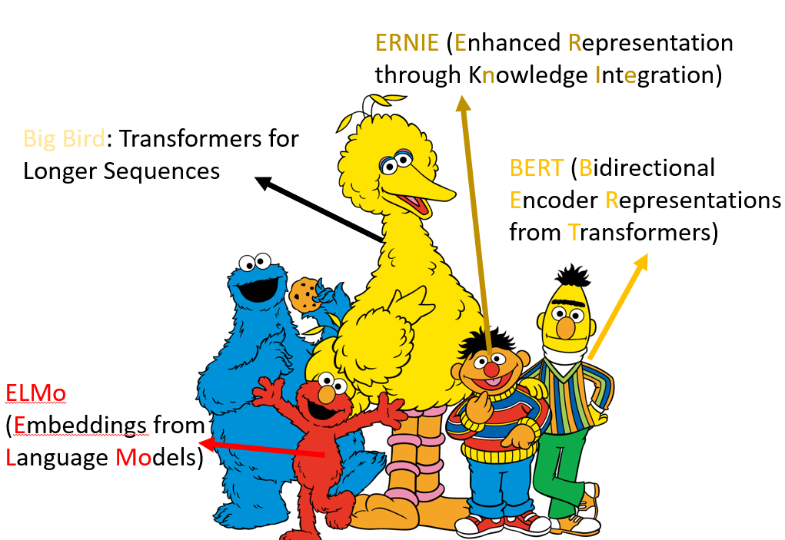

## BERT 的结构

沿用了 `Transformer` 的 `Encoder`。

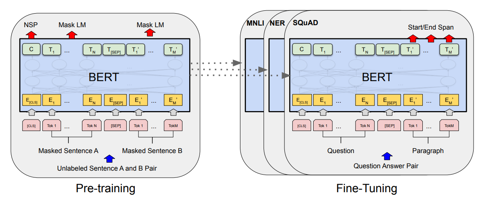

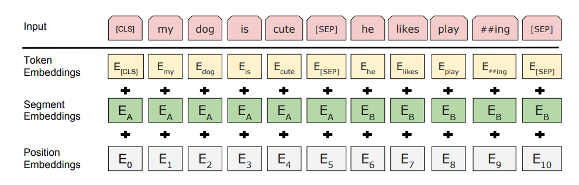

## BERT 是怎么学做填空题的？

> BERT 的作者认为：使用两个方向（从左至右和从右至左）的单向编码器拼接而成的双向编码器，在性能、参数规模和效率等方面都不如直接使用双向编码器强大；这是 BERT 模型使用 Transformer Encoder 结构作为特征提取器，而不拼接使用两个方向的 Transformer Decoder 结构作为特征提取器的原因。

> 这也令 BERT 模型不能像 GPT 模型一样，继续使用标准语言模型的训练模式，因此 BERT 模型重新定义了两种模型训练方法（即：预训练任务）：MLM 和 NSP。BERT用MLM（Masked Language Model，掩码语言模型）方法训练词的语义理解能力，用NSP（Next Sentence Prediction，下句预测）方法训练句子之间的理解能力，从而更好地支持下游任务。

### Masking Input

https://arxiv.org/abs/1810.04805

在给 `BERT` 数据的时候，将若干字替换成一个特殊的 `token`，或者随机的值。两种方式随机选择一种。

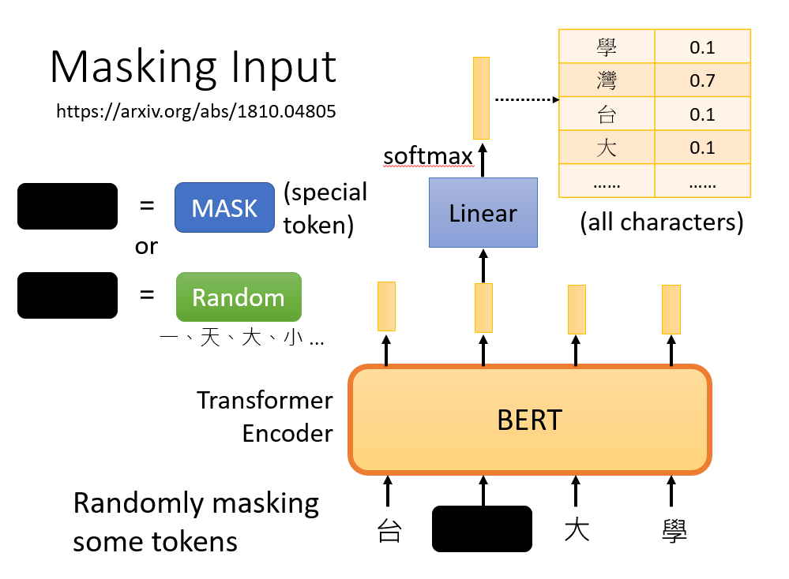

前面提到过，`BERT` 即是 `Encoder`，会输出一个向量的序列。 将这个向量经过一个线性层 + `softmax` 就可以得到遮住的字的概率分布。
我们既然已经知道“台”后面的字是“湾”，也就是说我们有标签，自然就可以用交叉熵作为损失函数训练咯~

这也就是“自己出题，自己回答”。

### Next Sentence Prediction 

`SEP` 区分两个句子。

这边只看 `CLS` 对应的输出，经过线性变换，做一个二元分类问题（Yes/No），即判断两个句子是不是相邻的。

## BERT 学到了什么？

自监督学习。

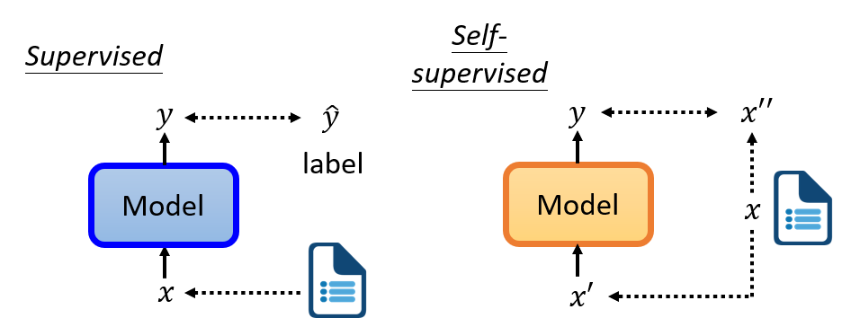

`BERT` 实际上学到了如何做填空题。

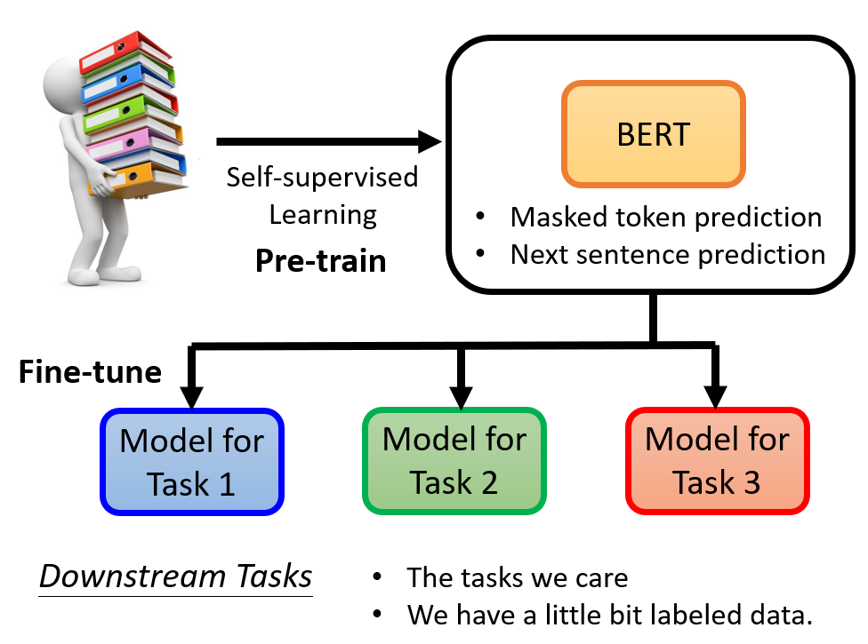

先预训练，然后在微调以适应不同的任务。就像一个干细胞，可以分化成任何人体细胞。

`BERT` 本身是无监督的（自己出填空题，自己学着做），但是其下游任务（downstream task）可能是监督学习的。比如语句情感分类，利用之前学习填空题 pretrain
过的 `BERT` 模型，将其输出经过另一个网络（这个网络是需要投喂数据集监督学习的），最终输出情感分类。

pretrain 过的 `BERT` 会比随机参数的好。All you need is **fine-tuning!**

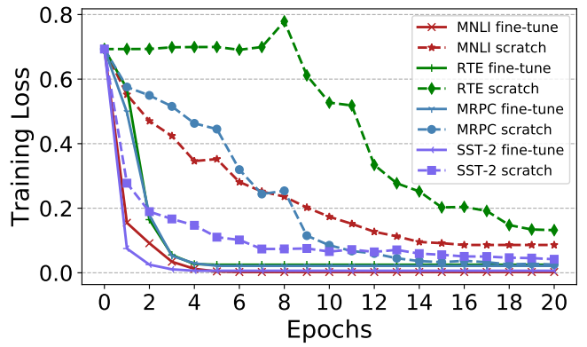

对于词性识别，流程也是类似的。生成的每个向量都通过一个待训练网络，剩下的和上面的例子一样。

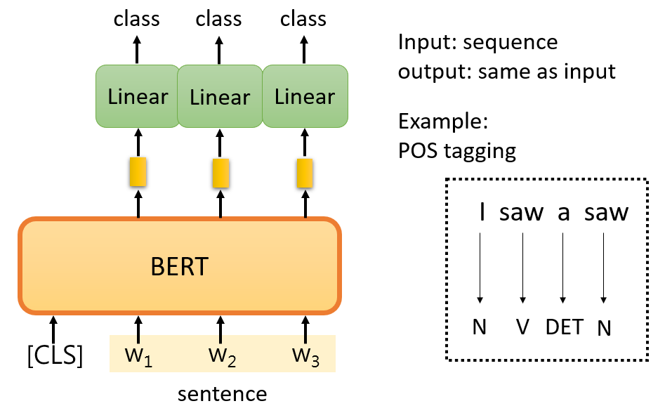

判断假设和推断是否矛盾：

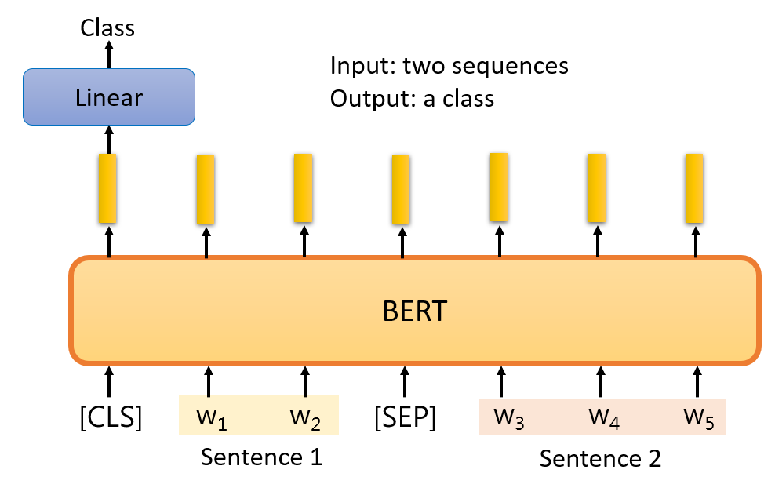

输入文章和问题，返回两个整数（答案的起止位置）：

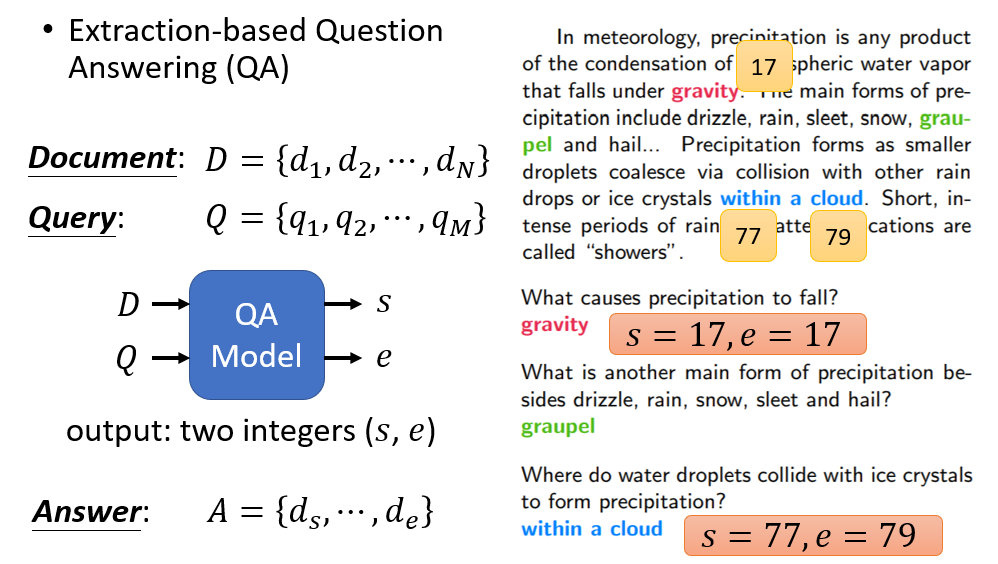

和自注意力机制类似，橙色部分类似于一个 `Query`，去查询 `document` 中的每一个 `Key`，最终经过 `softmax` 的到最大概率的作为 start。
这边 s = 2。

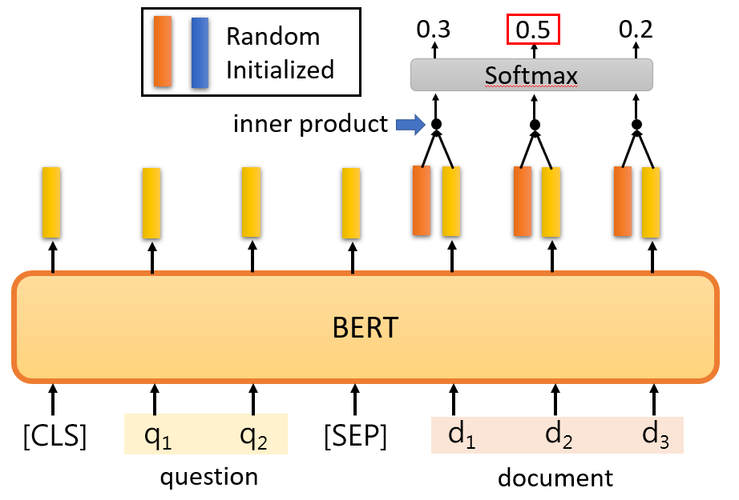

还有一个蓝色的向量需要学习，对应于 end。和 start 类似，这边求出 e = 3。于是我们得出了答案的范围。

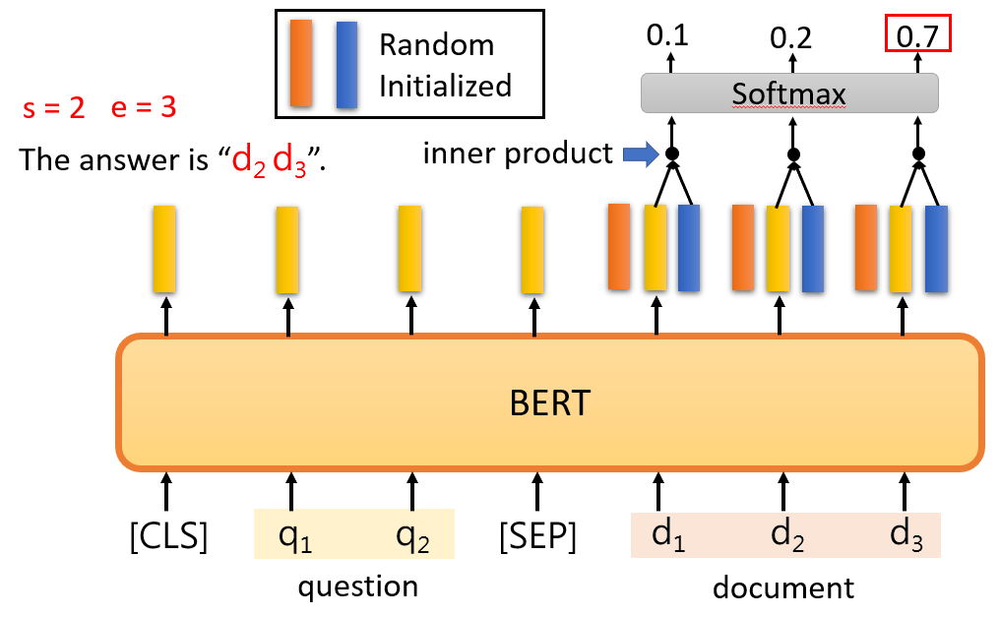

注意橙色和蓝色向量都是要训练的对象。

### Training BERT is challenging

训练 `BERT` 需要极大的数据量和极强的硬件。

### 预训练 Seq2Seq

类似的，也可以预训练 `Decoder`。将一些句子破坏掉（原始句子作为标签），进行 `self-supervise`

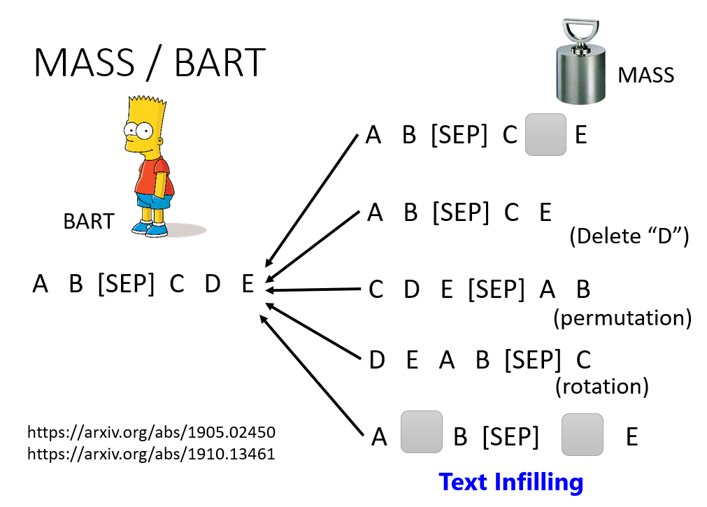

## 为什么 BERT 能够工作？

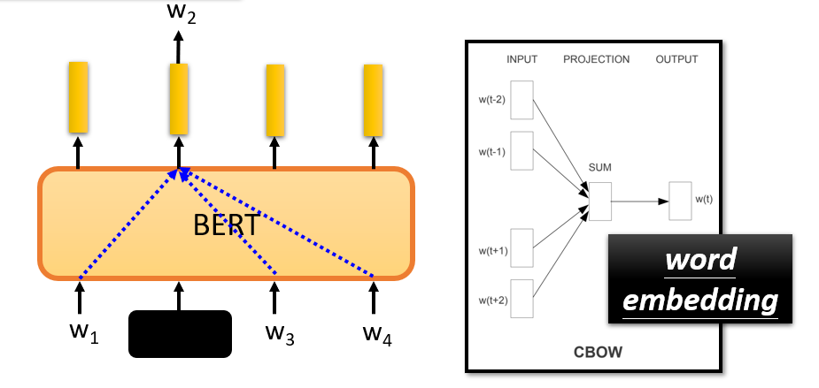

类似于 `word2vec`，`BERT` 能够将每个词都对应到一个向量（表征某个词的含义（meaning））。向量两两之间的距离代表了两个词的意思的接近程度。

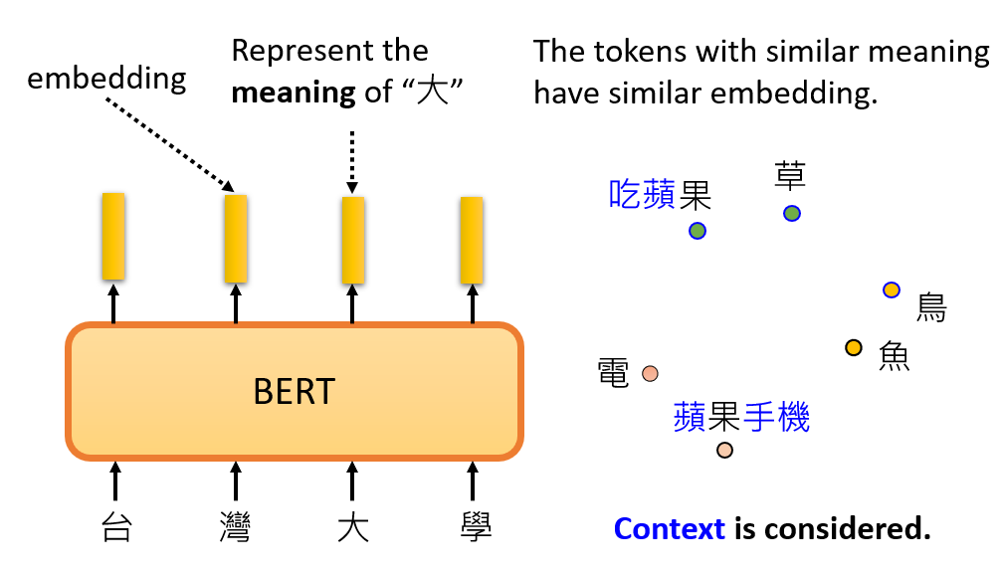

但是不同的是，`BERT` 在预训练的时候会学习到上下文信息，同一个字在不同的上下文中，其含义不同，`BERT` 输出的向量也不同。所以 `BERT` 输出的
`Embedding` 是动态的，会根据上下文的不同产生变化。

以 `苹果` 为例，“吃苹果”的“苹果”是一种水果，而“苹果手机”的“苹果”则是一个公司品牌名。

通过计算这两个苹果经过 `BERT` 输出的 `Embedding` 的 `cosine similarity`，可以得到下图：

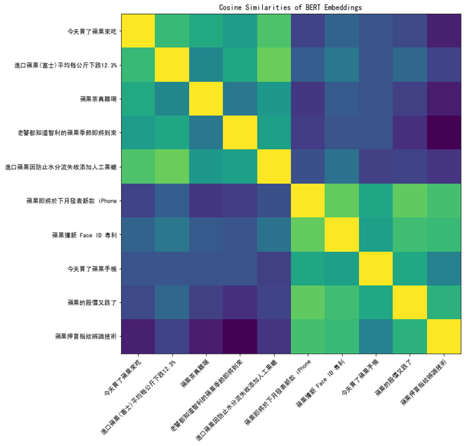

## 令人震惊的 BERT

### DNA classification

用语言资料预训练的 `BERT` 甚至可以提升 `DNA` 分类的准确度！

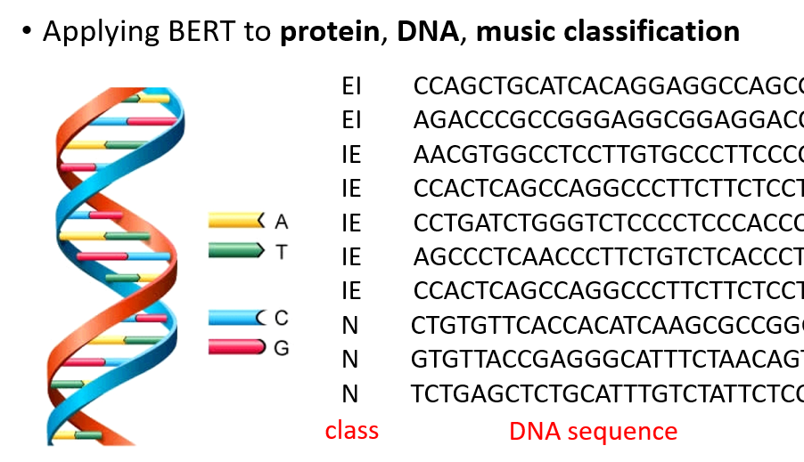

因为预训练用的是英语，所以这边需要将碱基对对应到一个随机词汇上，然后再对 `DNA` 分类问题进行 `Fine-Tune`。即使是这样八竿子打不着的映射，
居然也能学出更好的效果——难道 `DNA` 序列结构和某种语言语法结构有关？ 

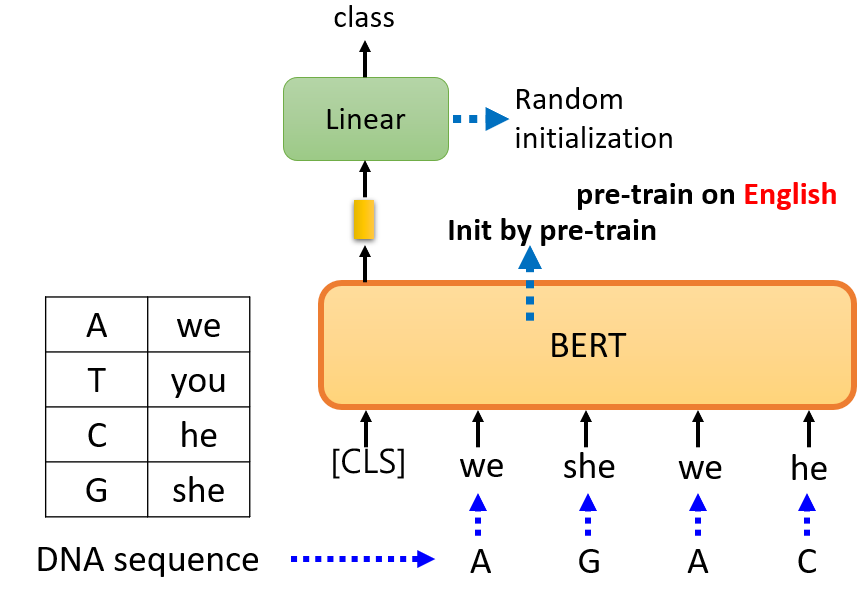

### Multi-lingual BERT

用多种语言的资料训练的 `BERT` 能够学习到语言之间的联系，在没有学习中文问答资料的情况下，输入中文问题居然也可以达到惊人的准确率。

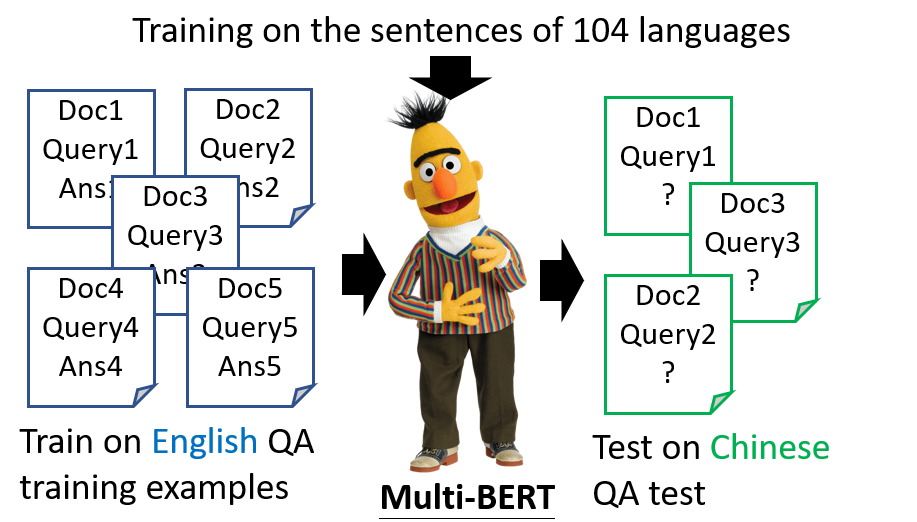

似乎 `BERT` 在学到 `Rabbit` 和 `兔` 的向量距离很近的同时，也没有忘记语言类型信息。也就是在回答中文问题的时候，它不会将 `兔` 替换成 `Rabbit`，
而是都用中文来回答。

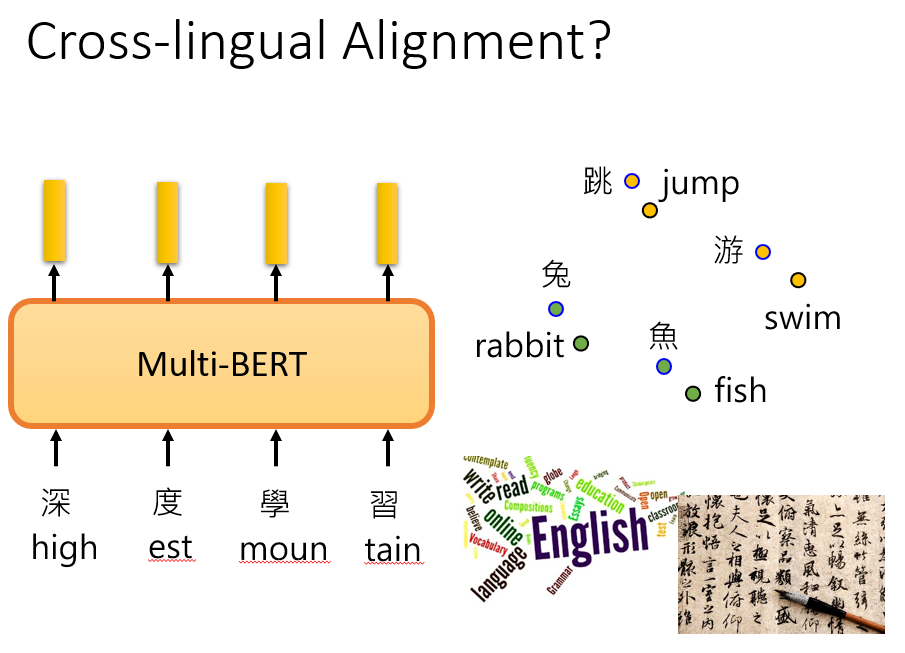

或许是因为，两个词汇虽然很接近，但是在它们所处的极高维空间内，它们根本不在同一个维度，只是距离相近，仅此而已。

如果将不同语言的所有词汇的 `Embedding` 求均值，将会发现这些语言在高维空间中散落在不同的区域。假如说你求出 `中文` 和 `English` 的这种距离，
然后将一个英文 `Embedding` 加上这个距离，你将会得到中文的 `Embedding`！

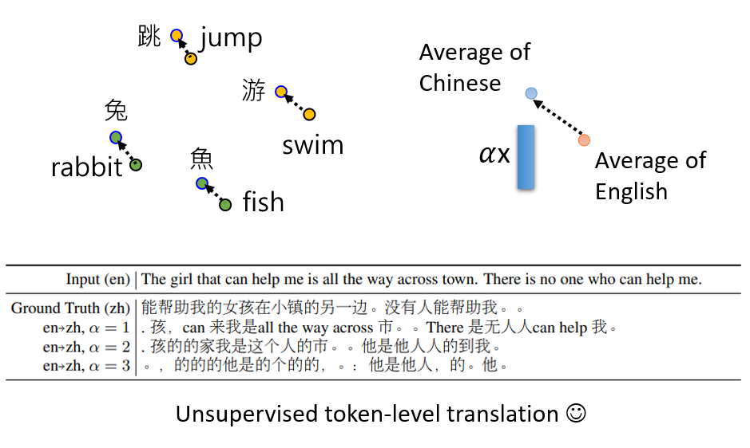

# GPT

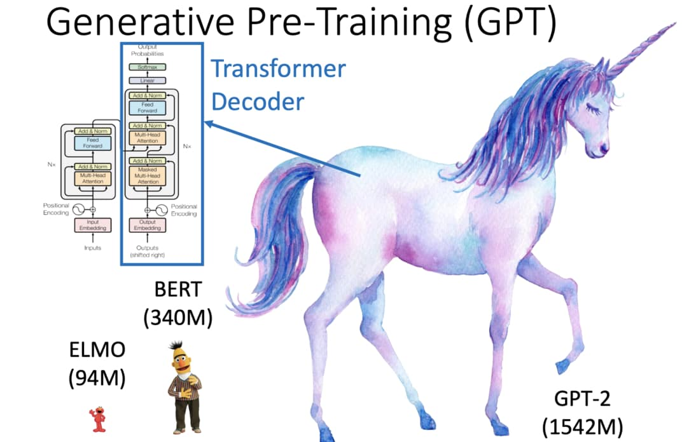

## 预训练

结构类似 `Transformer` 的 `Decoder`（使用 `Masked self-attention`）。

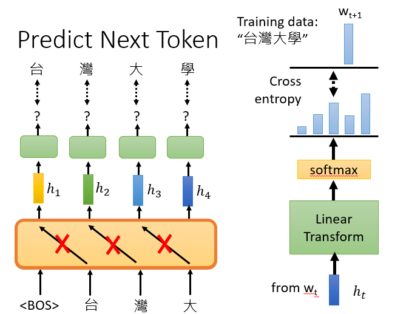

`GPT` 和 `BERT` 不一样的地方在于 `GPT` 是在是太大了，以至于我们难以 `Fine-tune` 它。 

### In-context learning
这里不会去利用梯度下降更新 `GPT` 的参数。

### Few-shot/One-shot/Zero-shot Learning

提供任务描述和例子，学会举一反三。

+ Few-shot:

    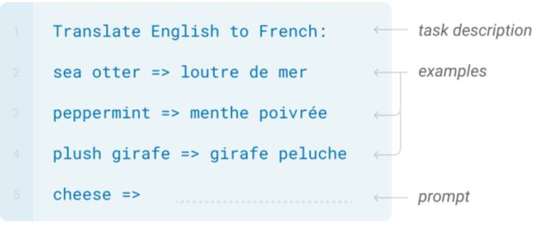

+ One-shot:

    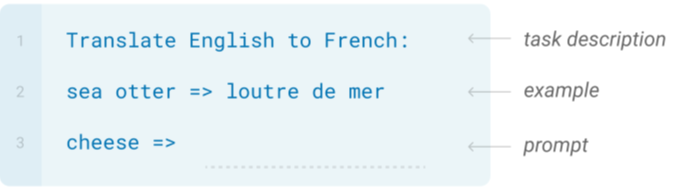
    
+ Zero-shot:
    
    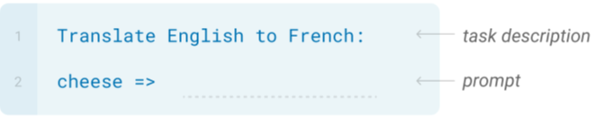
    
## 效果

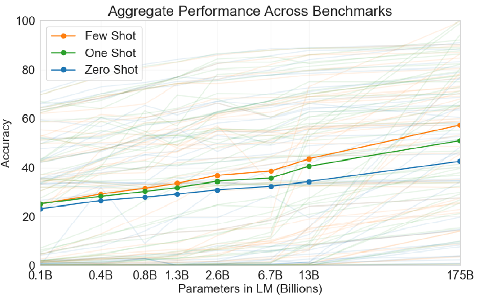

