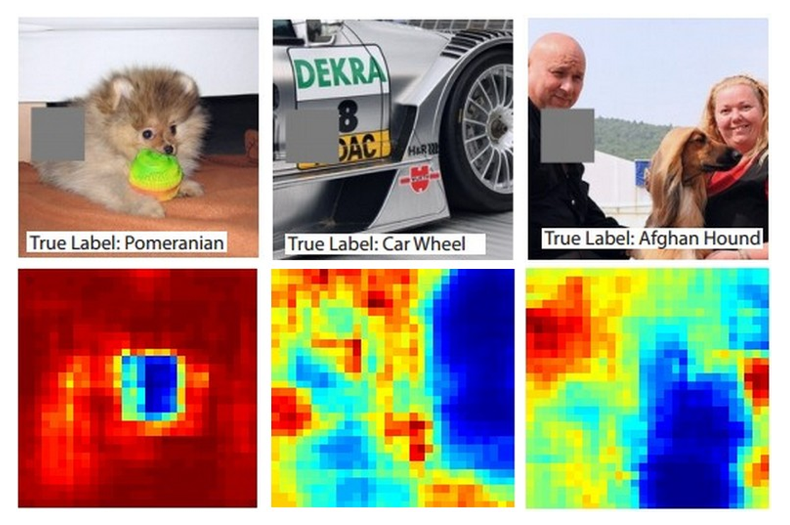
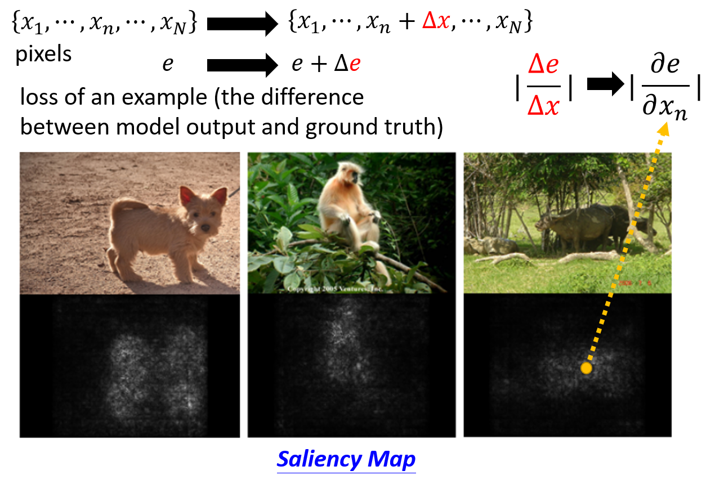
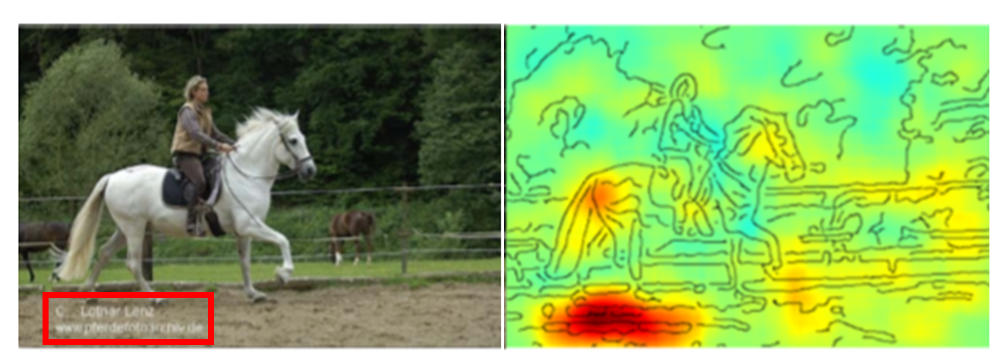
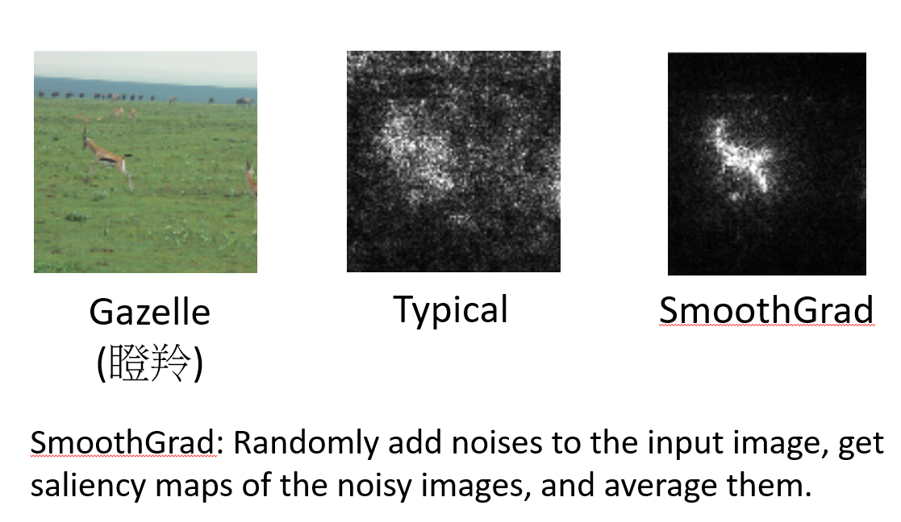
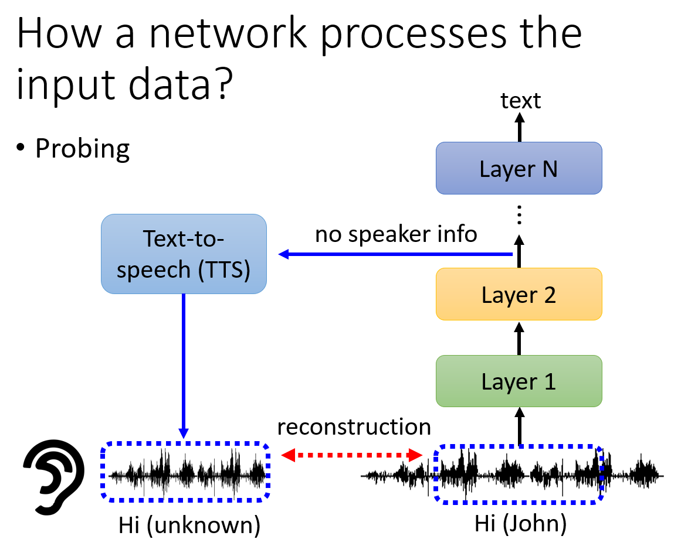

# Explainable AI

## 了解 AI 学习到了什么

### Mask

用一个灰色色块遮盖图像，最后一行的图像展示了不同位置遮盖之后分类的概率，由此我们可以发现模型学习到了什么重要的特征。

比如上图中的狗，遮住脸之后模型就无法辨别了，所以模型学习到了狗的面部特征。

### Saliency Map

修改某一像素的值 $e$，得到最终输出结果 $x$。计算 $e$ 关于 $x$ 的偏导数，将数值以下方的图像展示。

一般而言，如果这个偏导数很大，说明这个像素对模型判定结果的影响很大，可以证明这个像素较为重要。 

但是你不能说一个特征很重要，修改对应的像素就一定会产生很大的判定结果的变化。这是因为，以分类问题为例，假如说模型有充分的信心判定一张图片是狗的图片（判断到了很多特征，比如狗腿，狗头），
那么你修改其中一个比较重要的特征，可能还是不影响模型判断它是狗。

通过这种方式，你还可以判断你的模型是否真的学习到了正确的特征。下图是一个错误的例子，机器学习到只要判定左下角是否有文字，就可以判定是不是马，
因为所有的马的训练集都有左下角的文字。

### SmoothGrad

`SmoothGrad` 是对 `Saliency Map` 的一种改进。其做法就是将原图加随机噪声生成多份，再获取对应的多份 `Saliency Map`，最终取平均得到 `SmoothGrad`。

### 用另一个网络来聆听/可视化一个模型的隐藏层输出

