# GAN

物竞天择，万物一同进化，一同内卷。`Generator` 和 `Discriminate` 一同训练和进化，此乃 `GAN` 的核心。

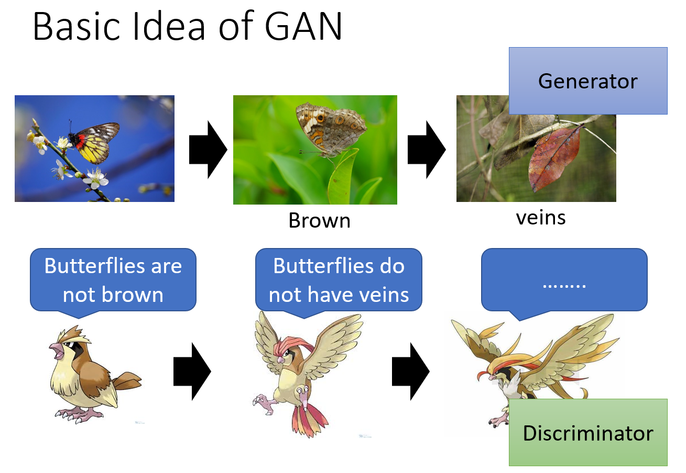
 
## 为什么我们需要输出一个分布（distribution）
    
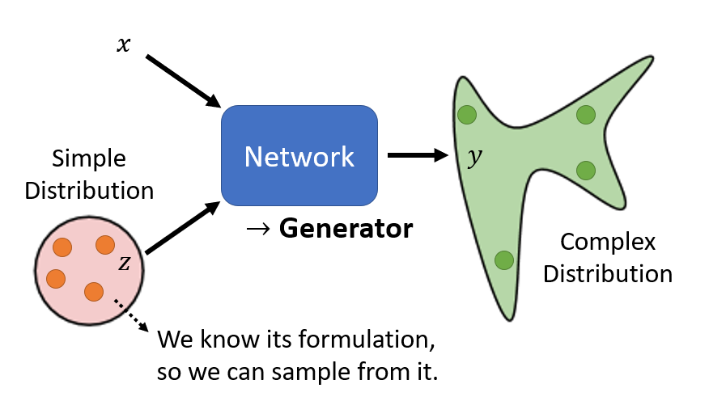

对于吃豆人这样的游戏，假如说我们要用一帧游戏画面去预测下一帧游戏画面，如果我们使用最传统的网络，接受一个确定的输入，然后输出一个
确定的结果，那么可能会出现如下的情况：

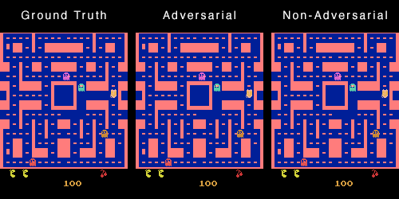

这是因为对于训练集中的不同数据，可能存在一帧画面完全相同，但是下一帧的画面相反（一个怪物向左，一个怪物向右）。模型为了获得最低的损失，
会倾向于输出既向左又向右的叠加态。

本质上这是因为我们输出的是一个固定的值/矩阵，而不是一个分布。假设我们输出的是一个分布，那么我们可以在输入的时候也加上一个分布 `z`（见第一张图），
来对应到输出的分布`y`。这样我们就可以用不同的输入分布来对应各种可能的情况：怪物向左，向右，向上，向下，死亡，存活。

本质上，这样的 `Generator` 适用于需要创造力的场景。
    
## Unconditional Generation
    
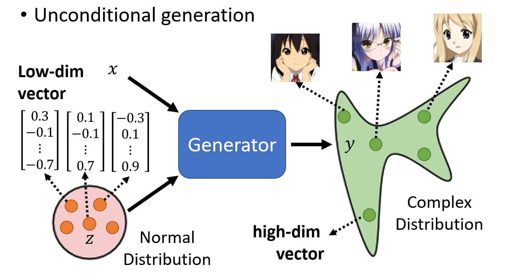

这里输入的分布可以是已知的，简单的分布，比如 `Normal Distribution`，网络会想办法生成一个复杂的分布。这个分布也就是一个高维的向量，
经过整理之后就会变成输出的图像。

我们还需要一个 `Discriminator`。它会接受 `Generator` 输出的图片作为输入，并且输出一个数值表示该图片是否是真实的二次元图片。

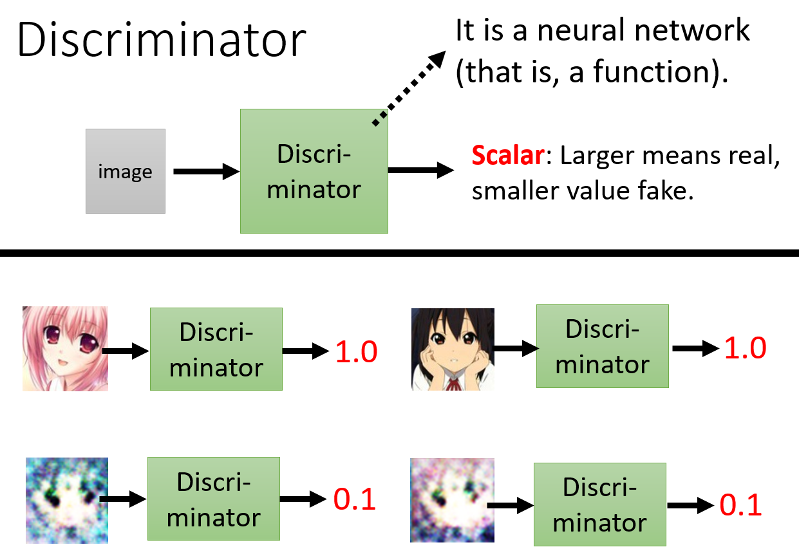
    
### 训练步骤
1. 初始化 `Generator` 和 `Discriminator`
2. 固定 `Generator` 的网络参数，训练 `Discriminator`，让它学会 **“打假”**：
    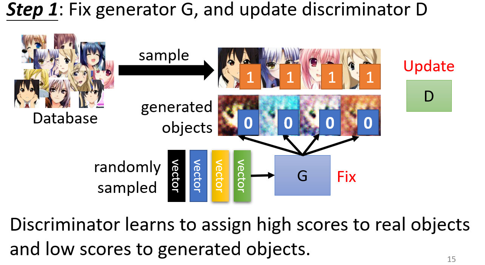
    1. 根据输入分布随机采样一些向量，经过 `Generator` 得到一些生成图片，这些图像是 **虚假的二次元图像** 标记为 0
    2. 从二次元图像数据集中采样一些图片，作为 **真实的二次元图片**，标记为 1
    3. 根据这些打好标签的图片，训练 `Discriminator`，本质上就是一个分类问题，训练一个 `classifier`。
3. 固定 `Discriminator` 的网络参数，训练 `Generator`，让它学会 **“造假”**：
    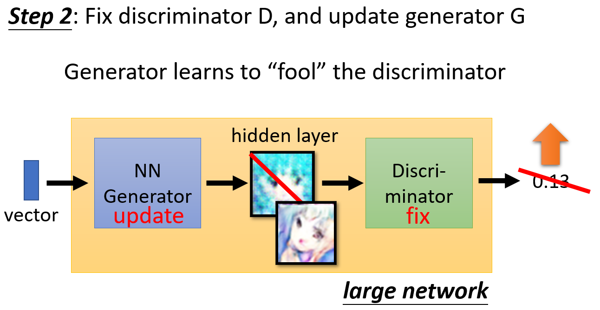
    将 `Generator` 的网络和 `Discriminator` 的网络拼接，但是固定后者的参数。两者之间会有一个 `hidden layer`，将其整理就是生成的图片。
    1. 根据输入分布生成向量，传入 `Generator`，生成图片，由 `Discriminator` 生成一个分数（目标是这个分数越大越好）。
    2. 根据 `Discriminator` 的打分，训练 `Generator`。
    
## GAN 的学习目标是什么？

我们希望 `GAN` 生成的分布 `PG`和真实的数据分布 `Pdata` 越接近越好（divergence 最小，即两种分布之间的某种距离）

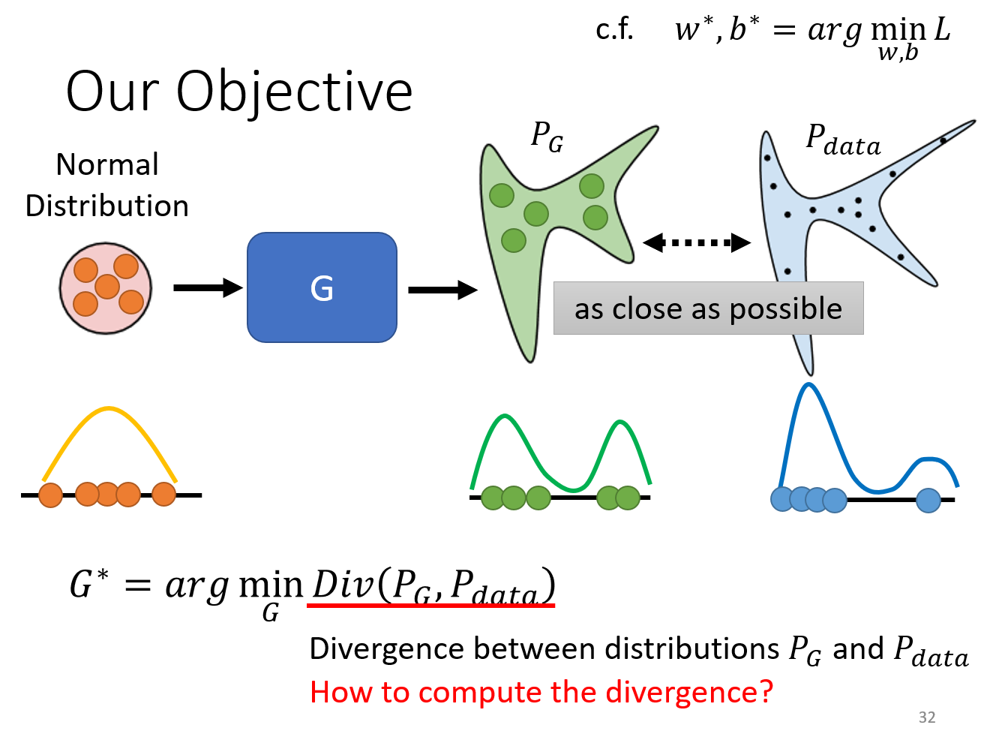

### 如何计算 `Divergence`？

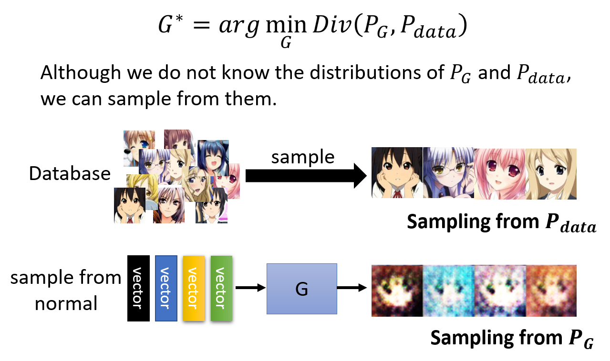

> Sampling is good enough.

+ 从数据集 sample 真实的图像，即对 `Pdata` 的 **sampling**
+ 根据输入的分布 sample 出一些向量，通过 `Generator` 得到图像，即对 `PG` 的 **sampling**

在只知道 sample 的情况如何估算 `divergence`？

下图是对于 `Discriminator` 的训练目标，蓝色星星代表真实数据的分布，橙色的星星代表生出数据的分布。我们的目标是让 `Discriminator` 能够区分两种分布。

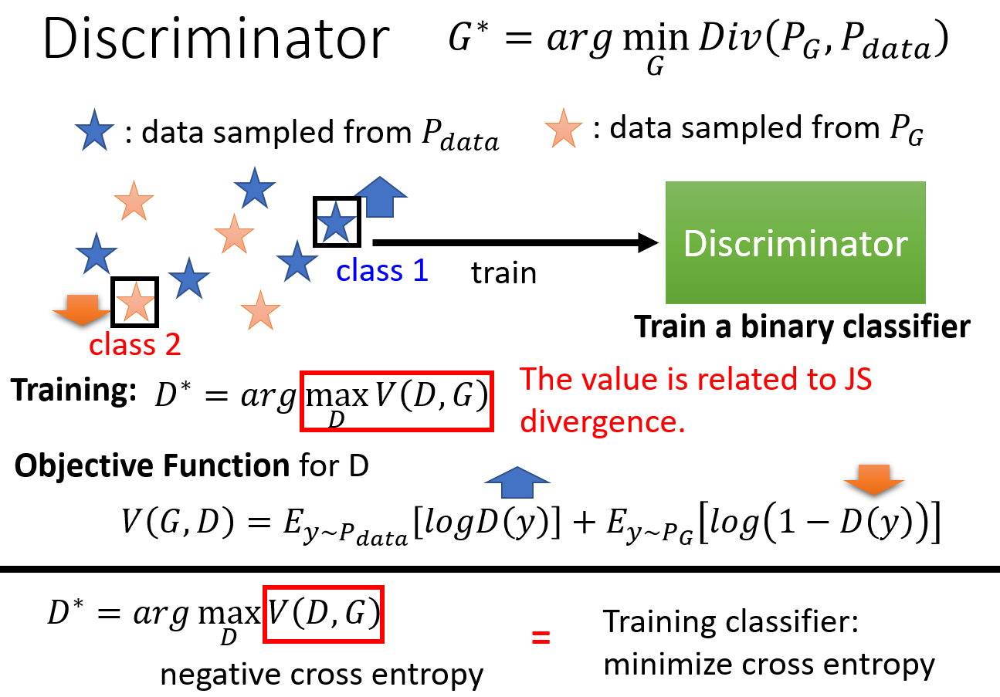

目标函数的左半部分代表我们希望由 `Discriminator` 生成的真实数据的期望分数应该越高越好，而生成数据的分数应该越低越好。损失函数可以是另外的形式，
这里是为了和二分类问题扯上关系。目标函数其实就是交叉熵乘上符号，也就是说我们要最大化目标函数，等价于最小化交叉熵。这与二分类问题的损失函数定义是类似的。

也就是我们在训练一个 `Classifier`。

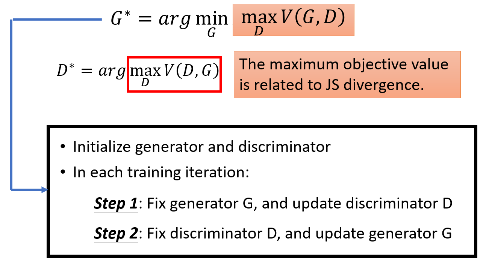

## JS divergence 不合适？

对于高维空间的两个分布（想象二维情况下两个直线），重叠部分几乎可以忽略不计。即使有重叠，如果采样数量不够，在 `Discriminator` 看来，两个分布依旧没有重叠。

JS divergence 不合适的理由在于，对于两个无重叠的分布，JS divergence会变为一个常数：log2，这将导致梯度消失，无法从 JS divergence 中获取两个分布的距离信息。
因为无论训练出来的分布和真实分布有多近，如果两者没有重叠的话，JS 散度永远是常数，也就无法由此来更新网络参数了。

（有关 JS divergence 可以看这篇文章：[GAN：两者分布不重合JS散度为log2的数学证明](https://blog.csdn.net/Invokar/article/details/88917214) ）

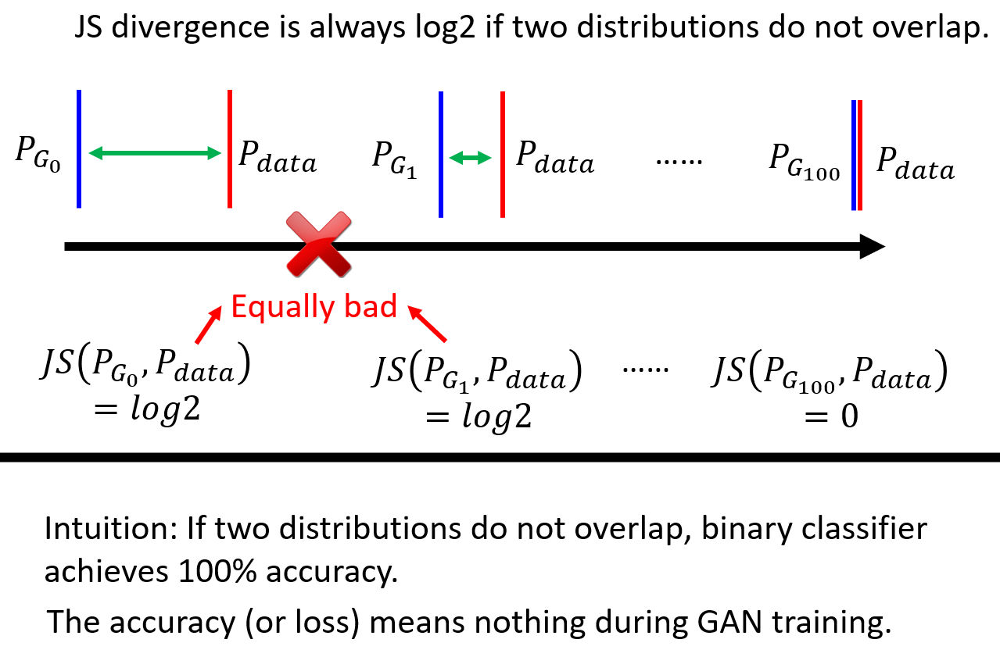

### Wasserstein distance

可以通俗的认为将一个分布变为另一个分布所需要的代价。分布就像是一堆堆土堆，然后用挖土机将一堆土堆变为另一堆土堆的模样的消耗，即为 `Wasserstein distance`。这本身也是一个优化问题，
穷举所有的 `moving plan`，看哪一个可以获得最短的平均距离，这个最短平均距离作为 `Wasserstein distance`。

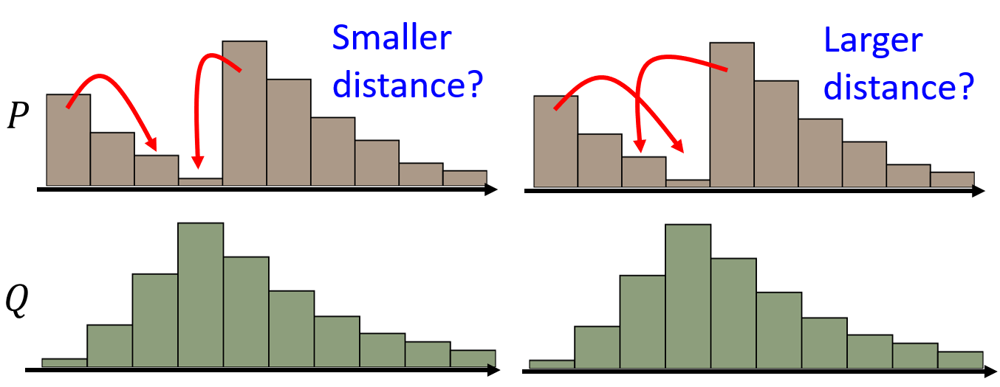

解决了 JS divergence 的缺陷：

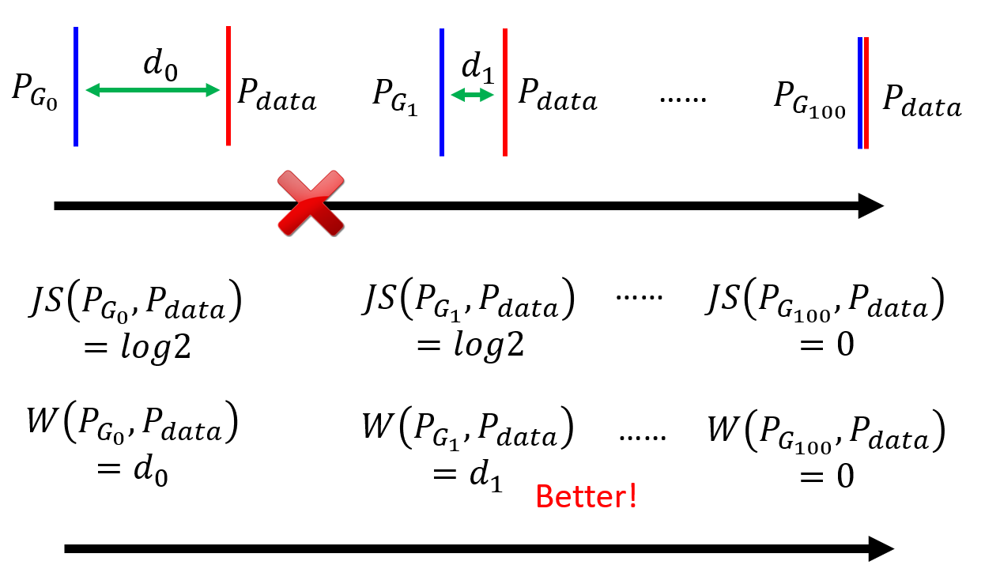

## WGAN

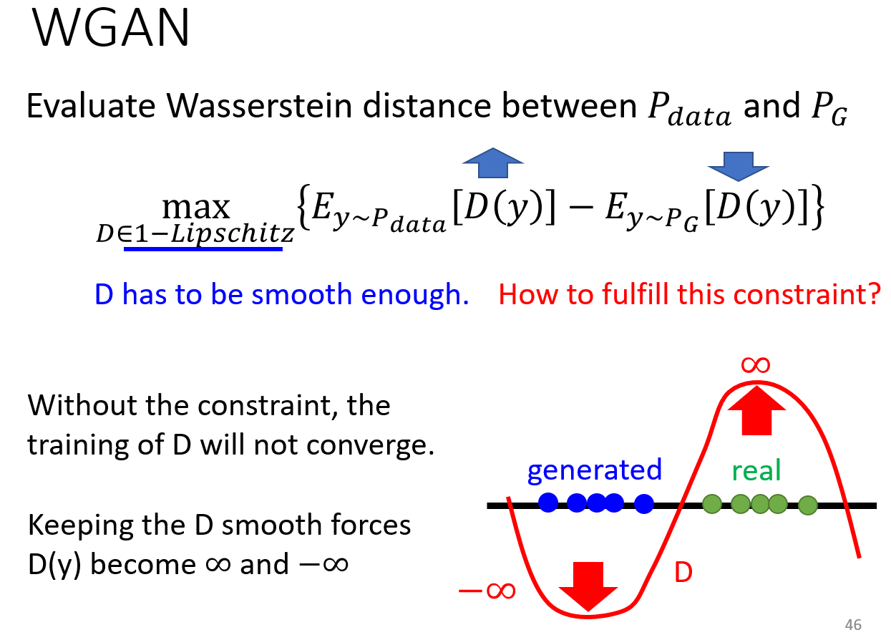

计算 `Wasserstein distance`，D 必须是平滑的函数，避免值剧烈变化，导致生成的分布和真实分布轻微偏离就产生无穷大的值。 

`WGAN` 这篇论文其实也没有找这样的函数（比较困难），而是将 `Wasserstein distance` 限制在 [-c, c] 之间（c 为常数）。 

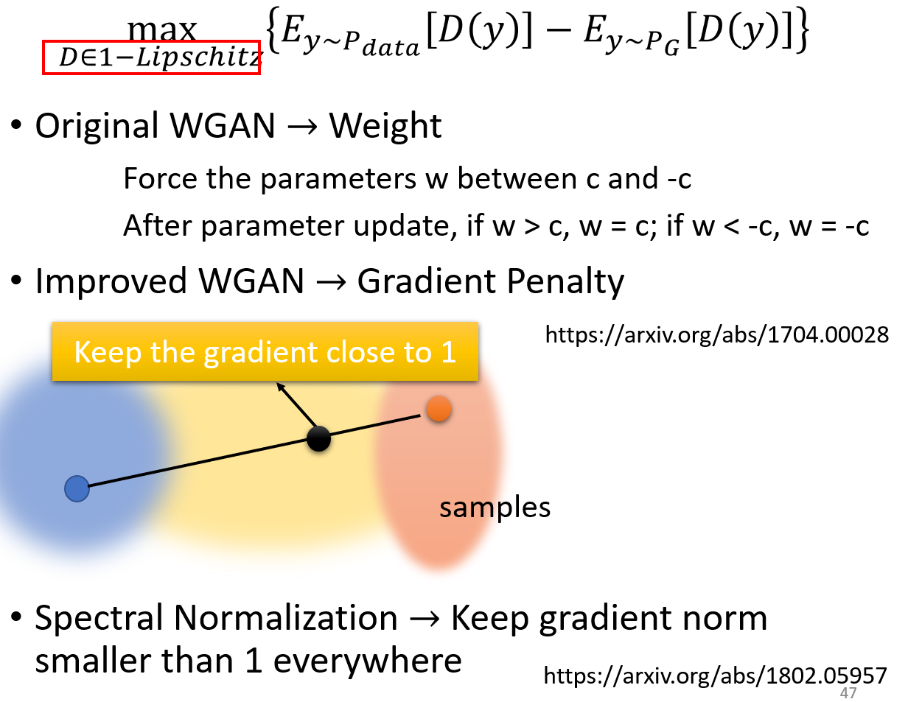

## GAN 存在的困难之处

+ 难以训练：
    
    GAN 是训练两个模型，一旦一个模型的训练出了问题，另一个模型也会出问题。也就是两个人一直在卷，卷到一半对手开摆，你也开摆！

    各种训练的 tips：

    + Tips from Soumith
        
        https://github.com/soumith/ganhacks
    + Tips in DCGAN: Guideline for network architecture design for image generation 
    
        https://arxiv.org/abs/1511.06434
    + Improved techniques for training GANs 

        https://arxiv.org/abs/1606.03498
    + Tips from BigGAN
        
        https://arxiv.org/abs/1809.11096
        
+ 难以做序列生成：
    
    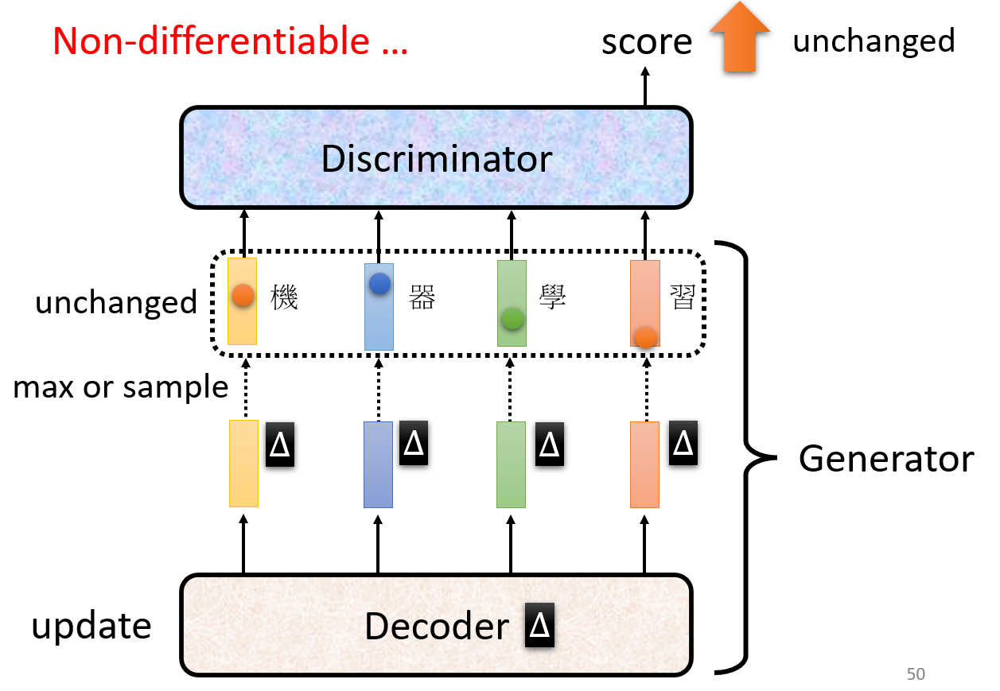
    
    Generator 的参数变化会导致输出向量的微小变化，但是由于输出的是一个概率分布，概率分布的微小变化不会显著影响取到最大值的那一维度，也就是微小变化可能不会导致输出词汇的变化。
    导致 Discriminator 无法进一步学习（梯度消失！）。
    
+ Mode Collapse

    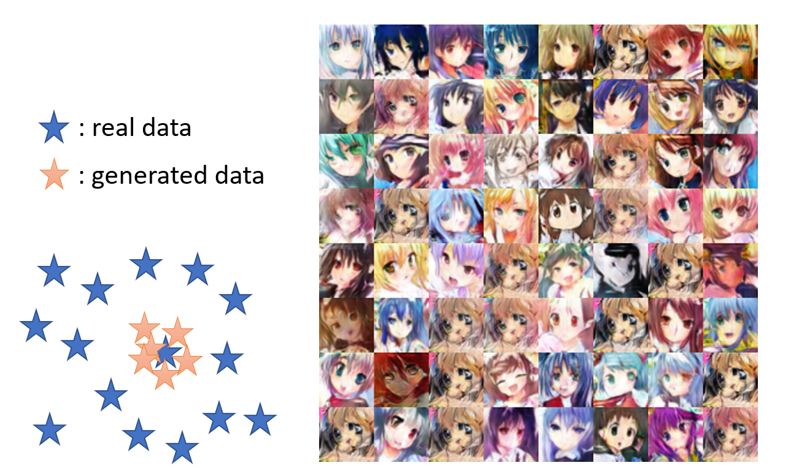
    
    Generator 发现生成某一个特征的图片可以永远骗过 Discriminator，于是它就倾向于一直输出类似的图片。
    
+ Mode Dropping 
    
    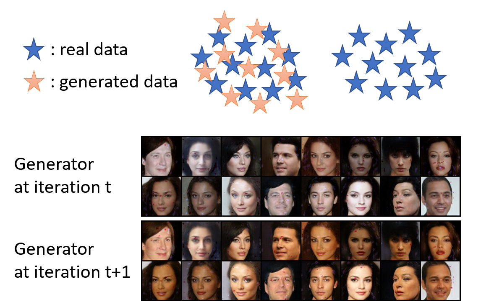
    
    多样性的丧失。

## GAN 评估

+ Inception score

    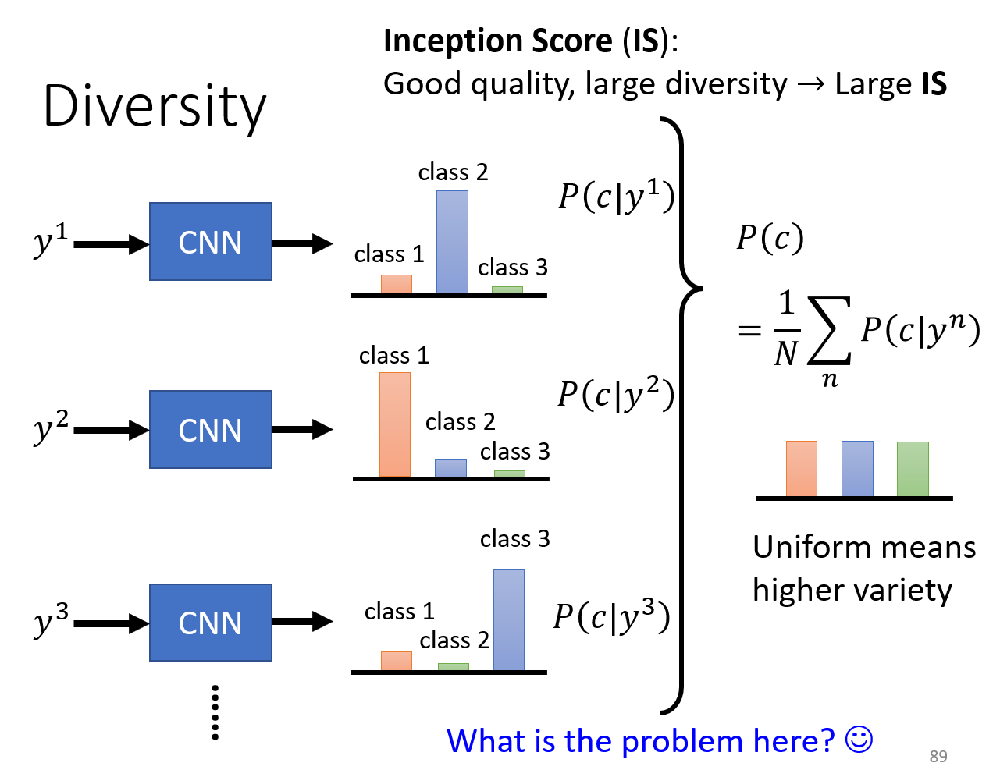
    
    问题在于，对于hw，判定图片质量的方式只是检测识别到了多少张人脸，而非检测红发，黑发，蓝发等多样性特征。
    
+ FID

    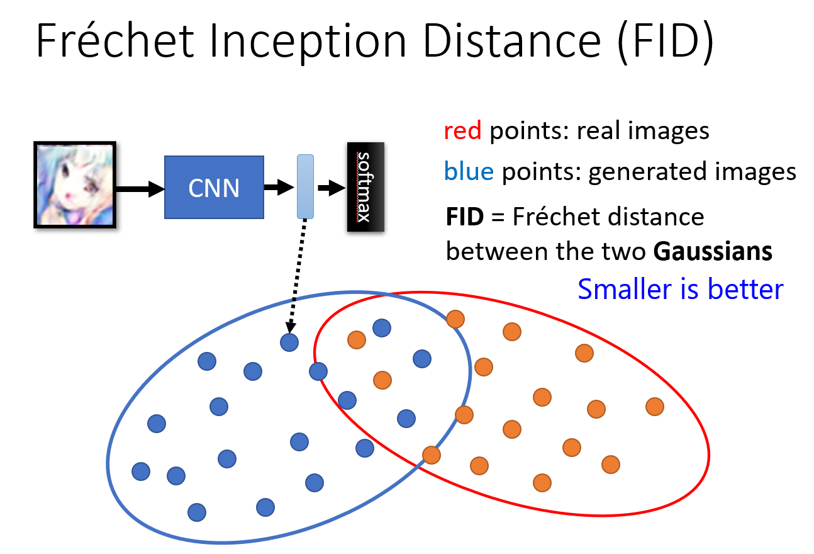
    
    取出 hidden layer 的向量而非输出的类别向量，计算分布的 `FID`
        
## Conditional Generator

我们无法使用之前无条件生成的架构，因为 Discriminator 只是在学习如何打假，而没有学习生成的图片是否满足给定的条件。

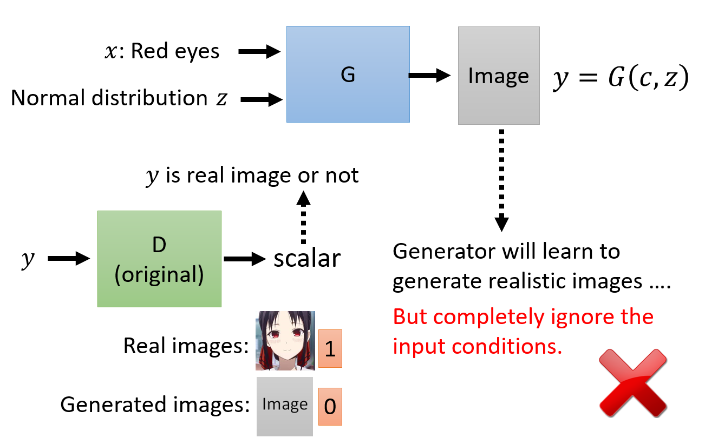

需要如下图所示的成对训练资料：

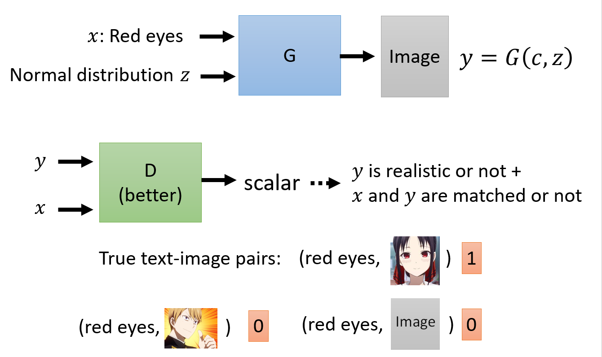

不同于之前无条件的情况进行“打假”，将所有训练集的数据都标注为真，生成的都标注为假，这里还需要选中一些训练集的数据（不满足给定条件），标注他们为假。

