# Reinforcement learning

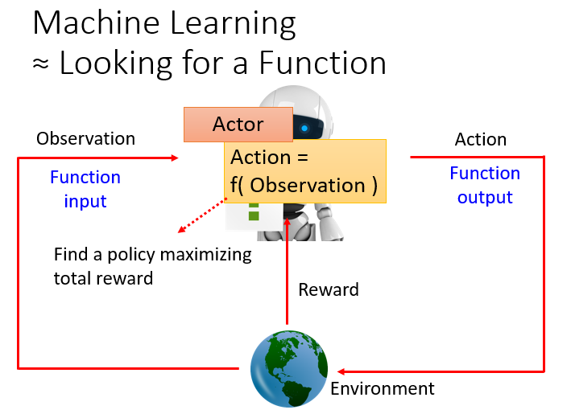

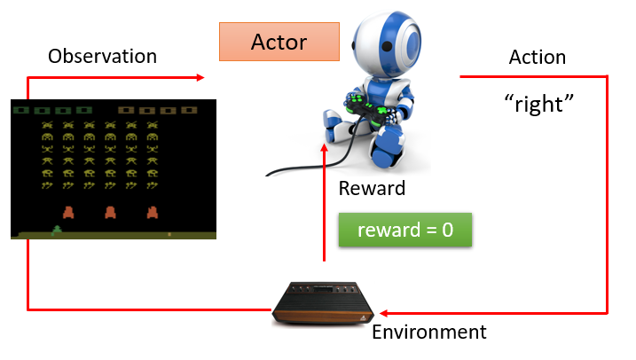

## ChatGPT 告诉我们 `Trajectory` 和 `Episode` 的区别

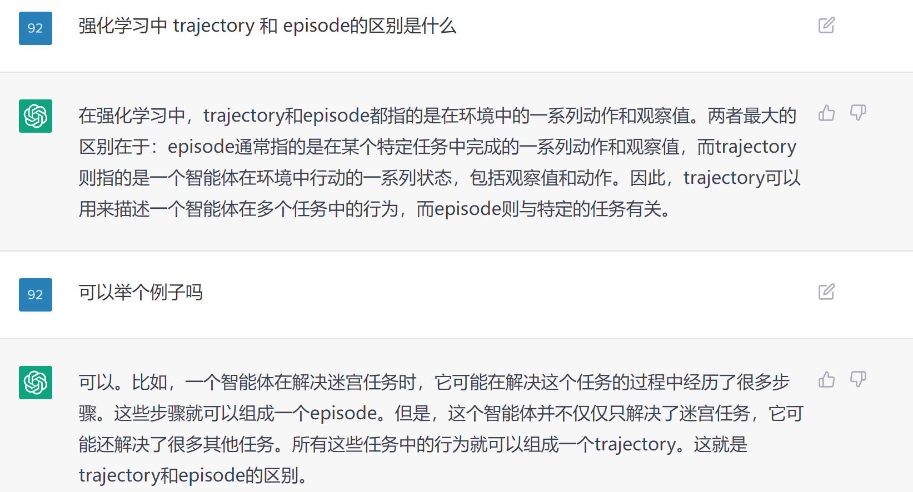

## 步骤
强化学习的步骤和基本的机器学习的步骤是类似的：

+ 第一步：找一个具有未知参数的函数：

    在强化学习中对应于 `Actor` 的 `Policy Network`，它通过从 `Environment` 获取 `Observation`，并基于此预测要执行什么 `Action`。
    如果这里的 `Action` 是 `stochastic` 的，那么就会得到一个 `Action` 的概率分布，类似于分类问题.
    
    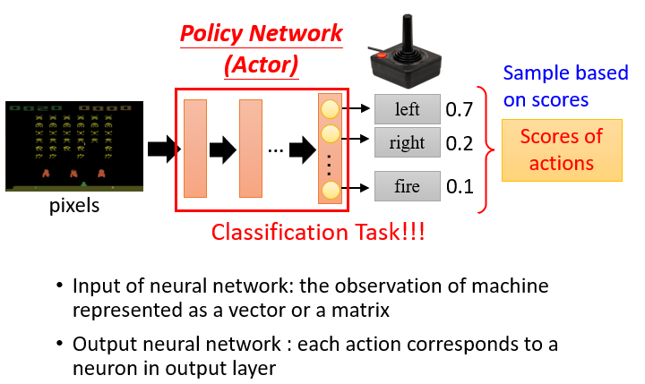
    
+ 第二步：定义 “loss”：
  
    我们要使得获取的总体奖励的期望值最大。
    
    `Total reward` = `Return`
    
    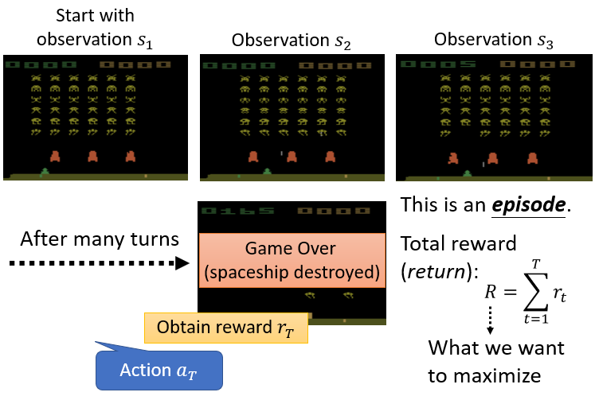
    
+ 第三步：如何进行优化：
  
    需要定义一个结束条件，然后让模型经历一个 `Trajectory`，要使得这个 `Trajectory` 获得的 `Reward` 最大。
    
    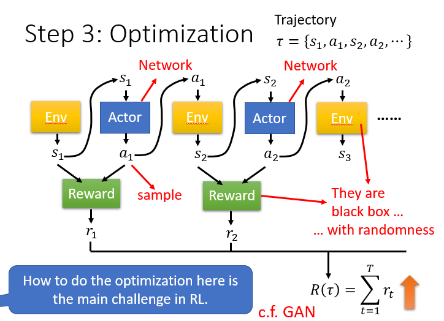
    
    `Actor` 与 `Critic` 和 `GAN` 有异曲同工之妙。`Actor` 对应于 `Generator`，生成带有随机性的决策；`Critic` 对应于 `Discriminator`，判定决策的分数，
    并为 `Actor` 修改策略提供依据和指正。但是不同点在于，`GAN` 中的 `Discriminator` 是一个已知的可训练的 model，而强化学习中的 `Environment` 和 `Reward` 更像是一个黑盒子，
    它们根本不是模型，无法用一般的梯度下降法来解决。
    
## How to control actor

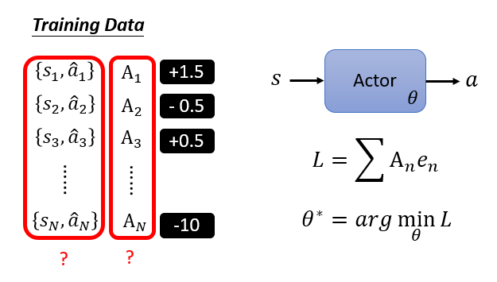

其中 $A_n$ 代表一个权重（正数代表我们希望这种动作发生），$e_n$ 代表第 $n$ 次动作产生的“误差”。

+ Version 0

    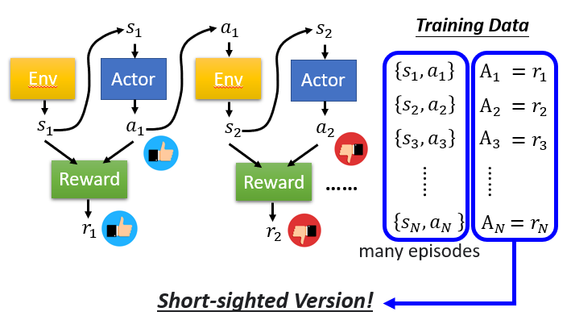
    
    缺点：如果只用一个动作获得的奖励（而不看后续获得的奖励的话），那么 `actor` 就会偏向于只追求短期利益，
    只追求会获得奖励的动作。这显然是错误的，本质上就是一种贪心策略。

+ Version 1

    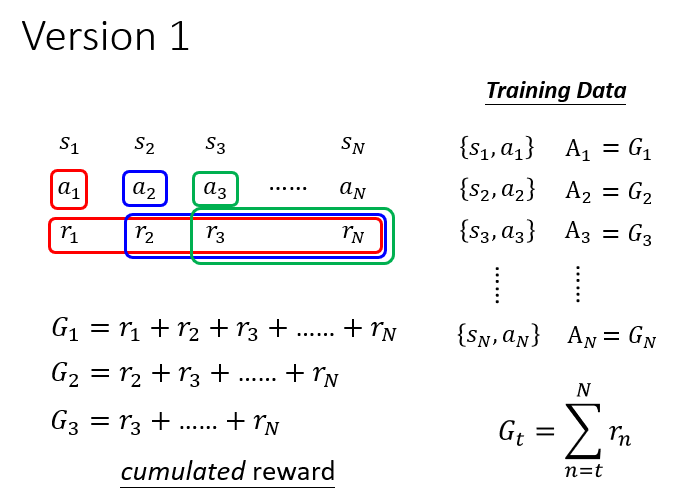
    
    改进之后会考虑后续的奖励了，但是在很久之后获得的奖励 $r_N$ 真的可以归功于动作 $a_1$ 吗？显然不能！
    我们希望奖励前面有个系数，且这个系数是衰减的，越遥远的奖励和当前执行动作的相关性往往越弱。

+ Version 2

    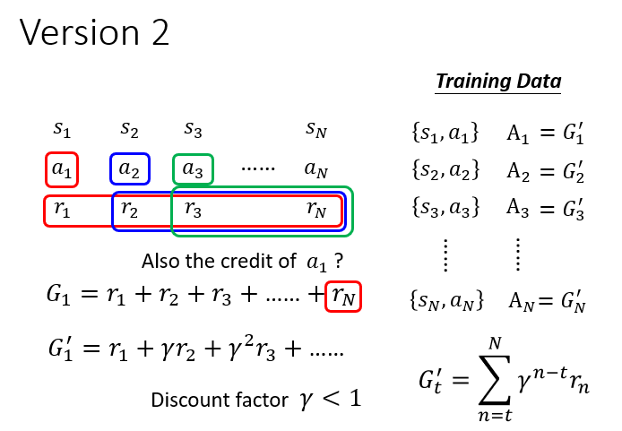
    
    引入折扣因子 $\gamma$ 解决上述问题。

+ Version 3

    奖励是相对的，有些环境只会产生正的反馈，那么如果不对奖励进行修正，那么一些低奖励的动作也会被鼓励。
    因此，可以对奖励减去基准 $b$，以对奖励进行标准化。
    
    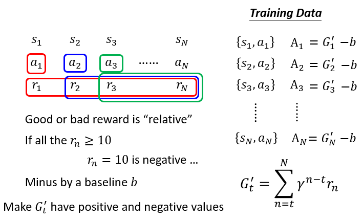
    
+ Version 3.5

    如何更好地确定系数 $A_n$？使用下面讲到的 `Critic` 的 `Value function`：
    
    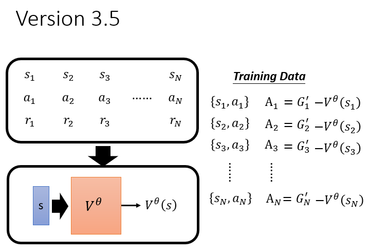
    
    $V^\theta(s_t)$ 是一个期望值，也就是一个均值（相当于你随机做一串动作获得的奖励差不多就是这个值），作为被减去的 `baseline`。
    
    $G^\prime_t$ 则是 `actor` 获取的实际收益。如果说这个收益大于均值，我们就认为这个动作是好的，是值得鼓励的。
    
    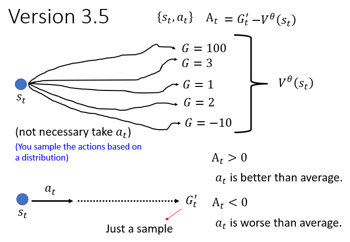
    
+ Version 4

    $V^\theta(s_t)$ 是多条路径取平均的结果（因为你在训练 `Critic` 网络并且让其趋向于期望值），
    而 $G^\prime_t$ 则是某一个 `sample` 的结果，假如说这个 `sample` 碰巧特别好或者碰巧特别坏，
    那么这样计算出来的差值真的能用来评估这个在状态 $s_t$ 下的动作 $a_t$ 的好坏吗？
    
    举个例子，假如说极端一点， $a_t$ 其实是一个极好的决策，但是后面的决策都做的烂的惨不忍睹，导致 $G^\prime_t \rightarrow -\infty$，这会导致 $A_t = G^\prime_t - V^\theta(s_t) \rightarrow -\infty$。
    这样就说明我们非常不鼓励 `actor` 去做 $a_t$，这不就事与愿违了吗？
      
    所以正确的做法应该是用平均减去平均，以评估 $a_t$ 这一动作的优劣，这也就是大名鼎鼎的 `A2C(Advantage Actor-Critic)`：
    
    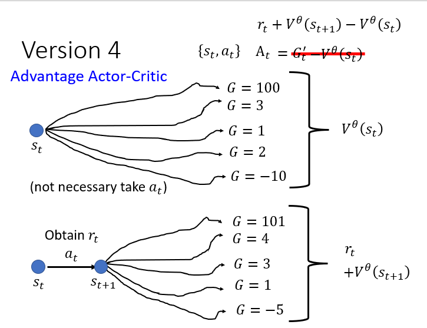
    
    注意到，我们上面说了 $V^\theta(s_t)$ 会趋向于累计奖励的期望值（乘上折扣因子），也就是说：
    
    $$
        E(G^\prime_t) = V^\theta(s_t)\\
        E(G^\prime_{t+1}) = V^\theta(s_{t+1})\\
        E(r_t) = E(G^\prime_{t} - \gamma G^\prime_{t+1})
        = E(G^\prime_{t}) - \gamma E(G^\prime_{t+1})
        = V^\theta(s_t) - \gamma V^\theta(s_{t+1})
    $$
    
    故而有：
    $$
        A_n = r_t - E(r_t) = r_t + \gamma V^\theta(s_{t+1}) + V^\theta(s_t)
    $$
    
    这里 ppt 上因为之前假设 $\gamma = 1$，所以上面省略了 $\gamma$ 这一因子。
## Policy-based & Value-based

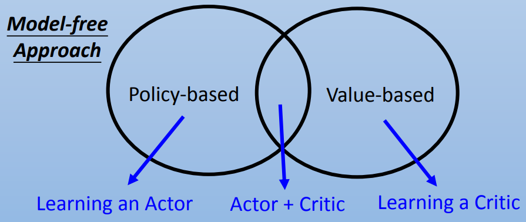

## On-policy vs Off-policy

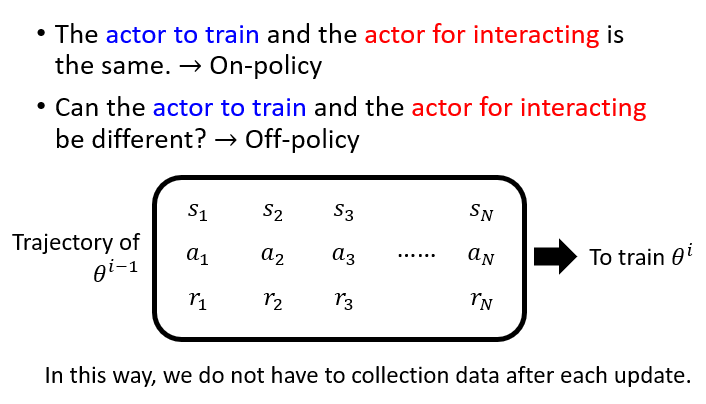
    
## Policy Gradient

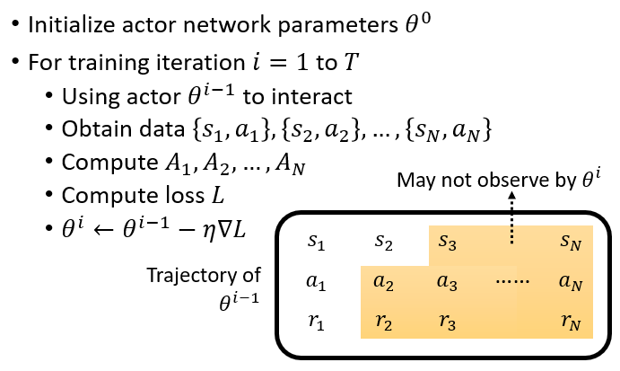

$R_\theta$ 代表了一个 `Episode` 获得的奖励的总和，$\pi_\theta$ 则代表我们的网络（`policy network`），其输入是环境的 `state` ，输出是执行各个动作的概率分布。我们希望 $R_\theta$ 的期望值 $\overline{R_\theta}$ 越大越好。

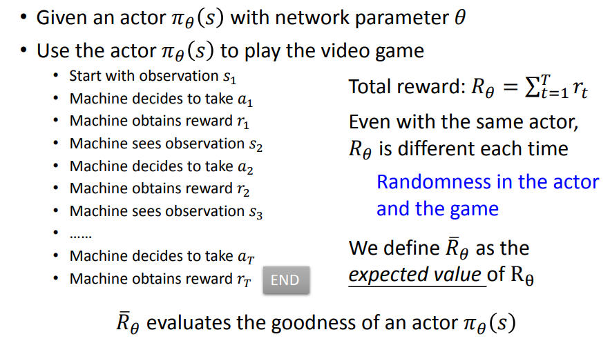

$P(\tau|\theta)$ 可以由下面的式子计算，其中 $\tau$ 代表了一个 `Trajectory`。

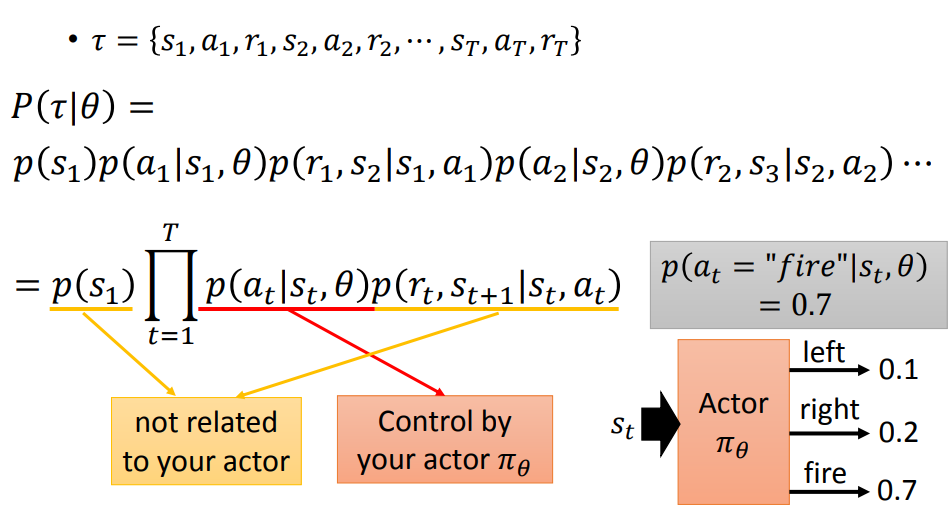

$R_\theta$ 的期望可以通过穷举获得（但是显然不可能，所以可以用尽可能多的次数来近似）

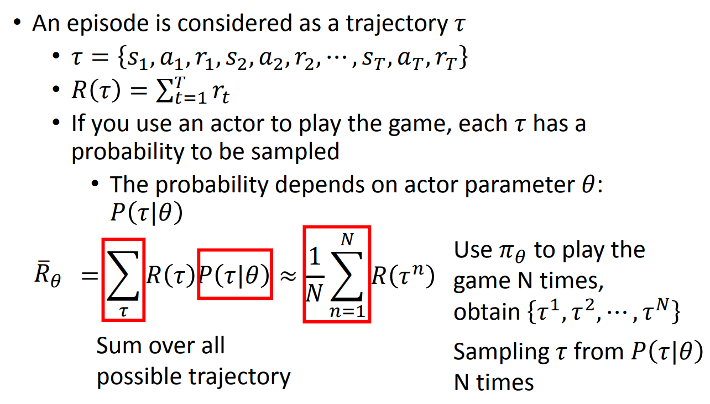

接下来就可以用 `Gradient Discent` 来解决这一问题：

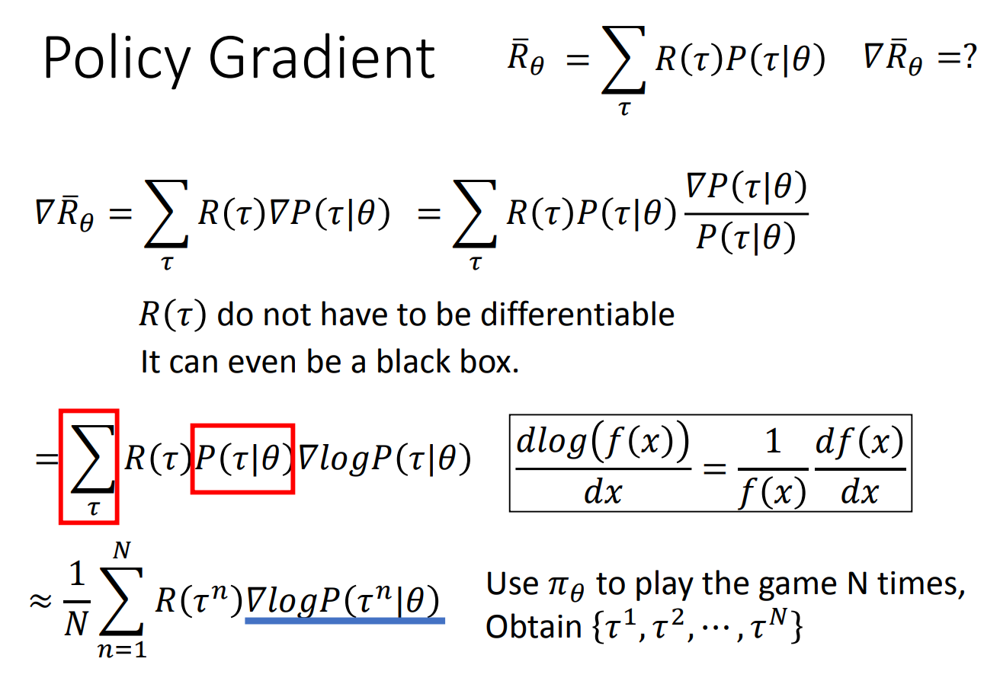

这里认为 $R(\tau)$ 和 $\theta$ 无关，所以即使 $R(\tau)$ 不可微分也无妨。
由右边的导数公式就能算出最后的结果。

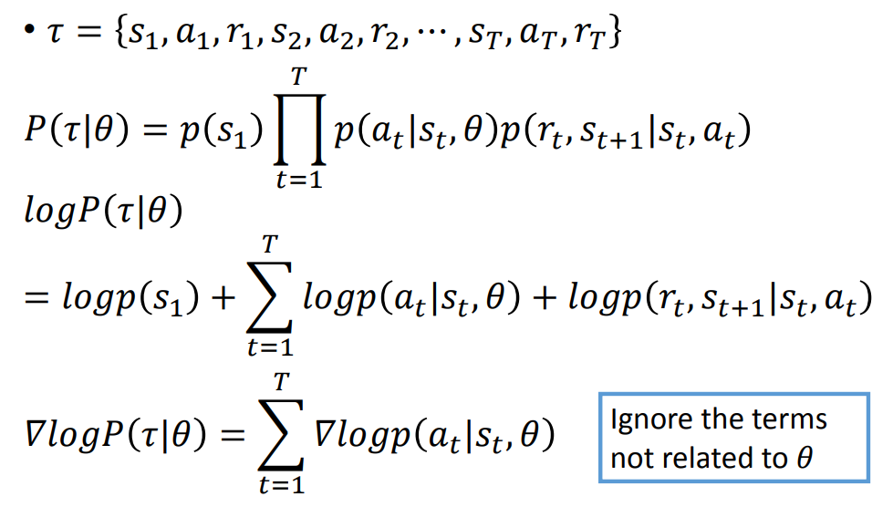

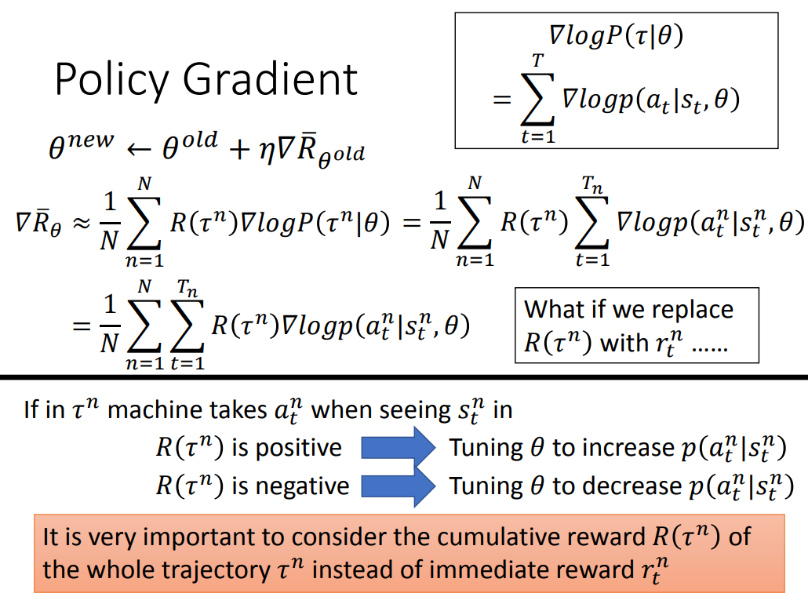

## Actor-Critic

### Critic

`Critic` 会有一个 `Value function` $V^\theta(s)$，它的值代表了 `actor` 看到状态 $s$ 之后所能获得的打过折扣的累计奖励的期望值。

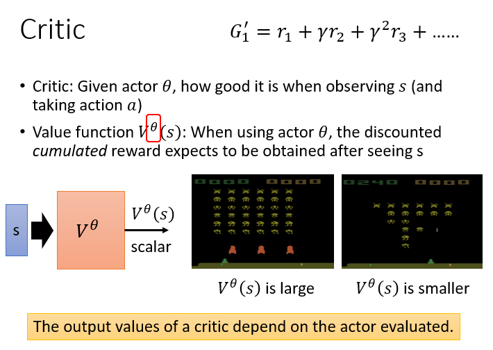

### 如何训练 `Value function`

+ 蒙特卡罗方法

    让 `actor` 与环境交互若干次。每次都会获取奖励 $G$，我们期望 $V^\theta(s)$ 的值和 $G$ 越接近越好，可以用 `MSE` 作为损失函数。

    比如下面的例子，我们就希望 $V^\theta(s_a)$ 与 $G^\prime_a$ 越接近越好。

    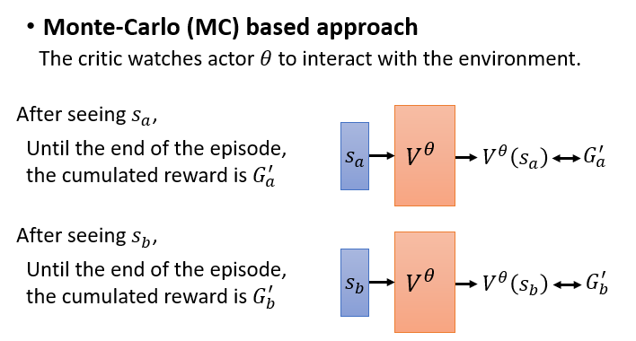
    
+ Temporal-Difference（简称 TD）
  
    与蒙特卡罗方法不同，`TD` 是每一步都进行参数更新。
    
    由：
    
    $$V^\theta(s_t)=\gamma V^\theta(s_{t+1})+r_t$$，
    
    可知：
    
    $$V^\theta(s_t)-\gamma V^\theta(s_{t+1})=r_t$$
    
    所以此时我们只要让 $V^\theta(s_t)-\gamma V^\theta(s_{t+1})$ 和 $r_t$ 尽可能接近就行。因为在 $t$ 时刻获得的奖励 $r_t$ 是已知的。
    
    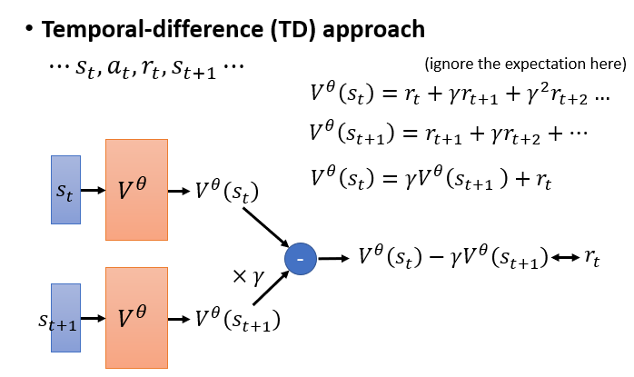
   
+ 蒙特卡罗方法和 TD 可能会计算出不同的 $V^\theta(s)$

    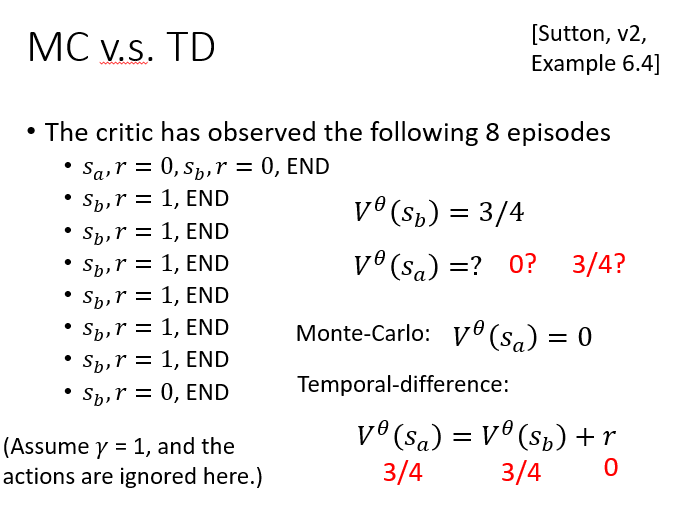
    
### 整体训练技巧

Actor 网络和 Critic 网络可以共享。

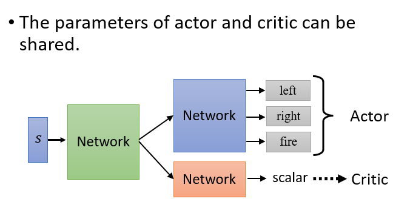

