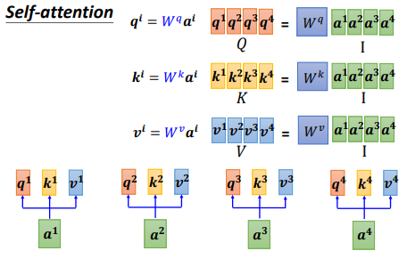
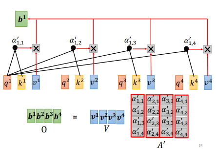
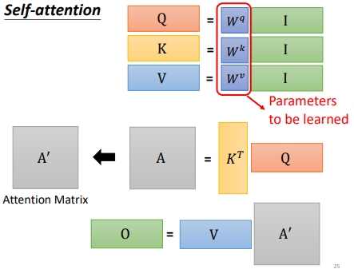
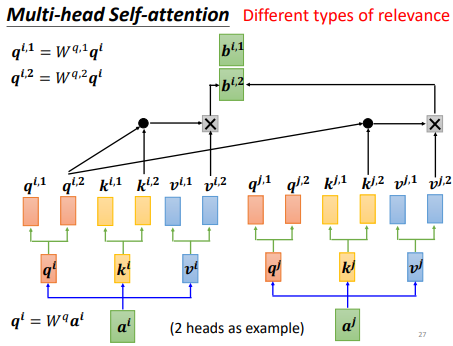
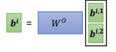
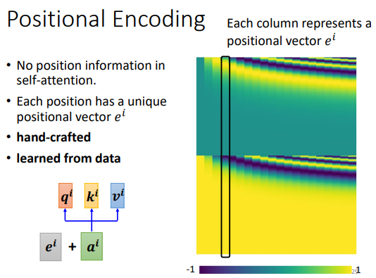
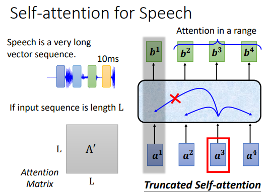
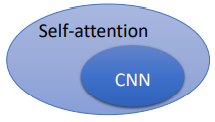
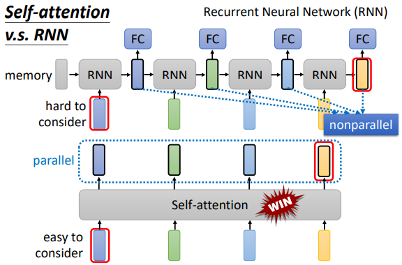
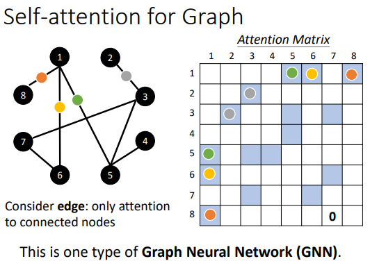

# Self-attention

+ 自注意力机制的矩阵运算：
   
   `q` 即 `query`，`k` 即 `key`，`v` 即 `value`
    
    
    
    `α` 即为注意力分数，经过 `softmax` 进行归一化得到 `α'`，并与 `v` 相乘得到最终的 `b`
    
    
    
    
    
+ 为什么我们需要多头注意力机制（`Multi-head Self-attention`）？

    `Self-attention` 实际上就是去找和 `q` 相关的 `k`，但是相关性是一个比较复杂的东西，我们往往需要多个维度对相关性进行描述，
    即使用多个 `q` 负责不同的相关性。
    
    
    
    将多个头获取的 `bi` 进行 **concat**：
    
    
    
+ 有什么不足？缺少位置信息：

    解决方案：`positional vector`，每一个位置都对应一个不同的位置向量 `ei`，
    
    
    
+ 我们真的需要**读一整句话**吗？
    
    对于像语音识别这样的序列而言，我们会把每 10ms 的语音数据作为一个向量，那么一句话就会对应相当可观的序列长度 `L`。而我们产生的注意力矩阵的规模和 `L` 的二次成正比，
    如果 `L` 非常大的话，注意力矩阵也会相当大。所以我们实际上不会读一整个句子，而是使用所谓 `Truncated Self-attention` 去读一个窗口（其大小可以自行指定）
    
    
    
+ `Self-attention` vs `CNN`：
   
    图片亦可作为 `set of vector`，所以 `Self-attention` 亦可用于图像领域。`CNN` 的卷积核代表了一片感受野，其大小是受限的，而 `Self-attention` 则关注了整张图片的信息。
    
    > CNN is simplified self-attention(self-attention that only attends in a receptive field).
                                                                                                                                                           
    或者你也可以说：
                                                                                                                                                          
    > Self-attention is the complex version of CNN(CNN with learnable receptive field).
    
    
    
+ `Self-attention` vs `RNN`：

    `RNN` 只能获取左边已输入的序列的信息吗？不，可以用双向 `RNN`，即 `Bidirectional RNN`
    
    `Self-attention` 可以并行处理（矩阵运算，GPU 优化），并且可以轻易获取非常远的上下文信息。
    
    
    
+ 在图中使用自注意力机制：

    
                                                                                                                                                                                                                                                                                                                                                                                                                                                                                                                                                                                                                                                                                                                                           