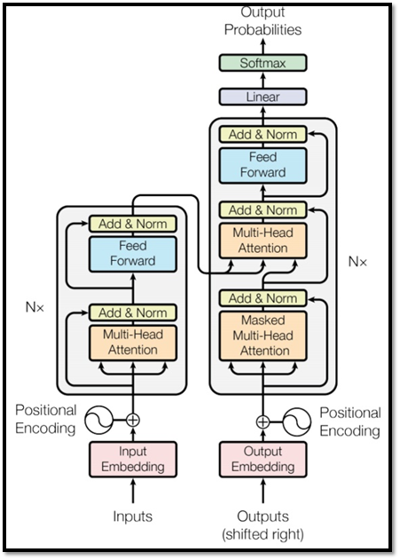
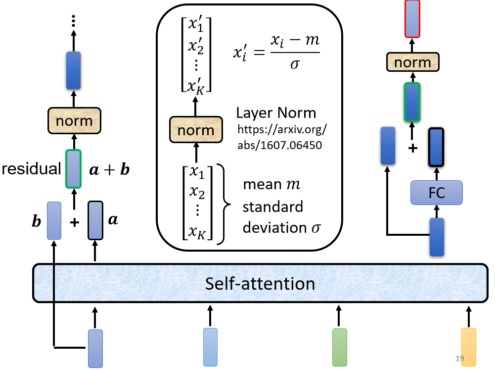
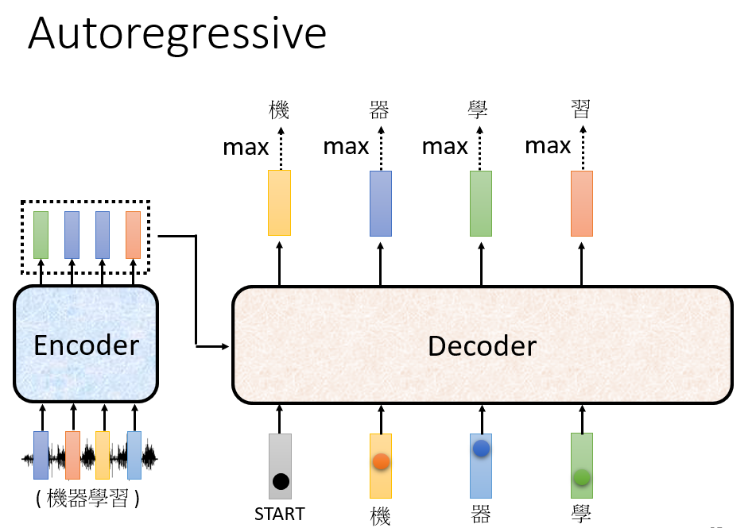
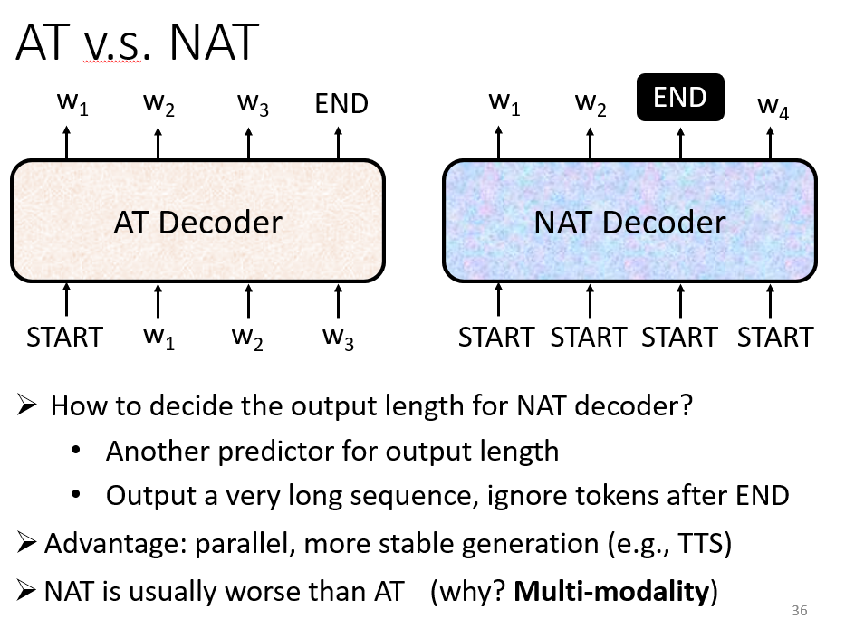
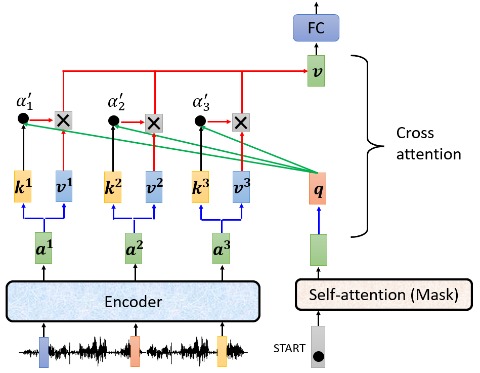
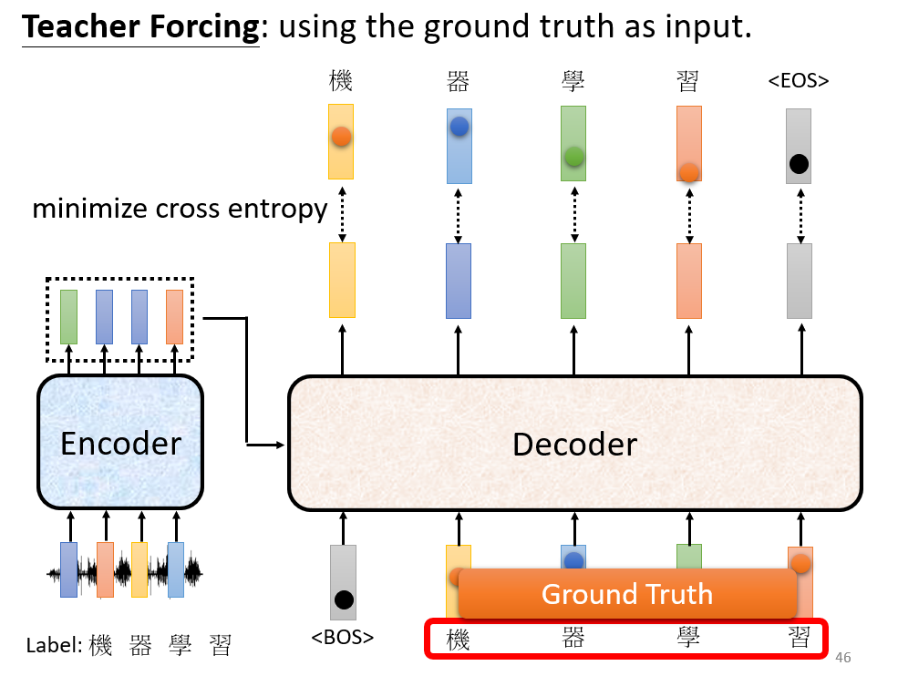
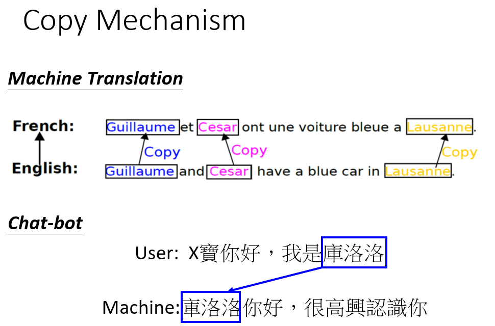
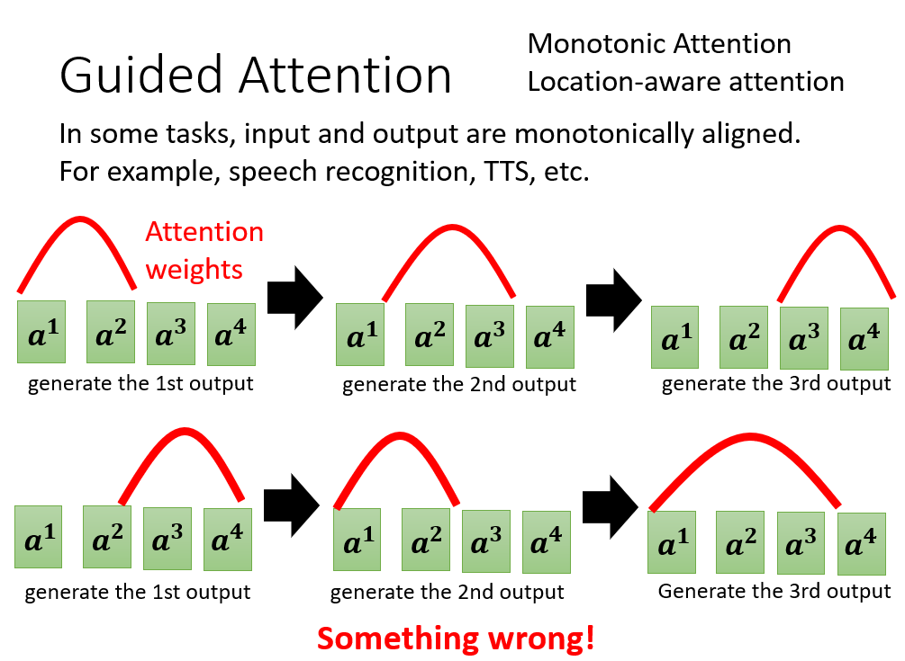
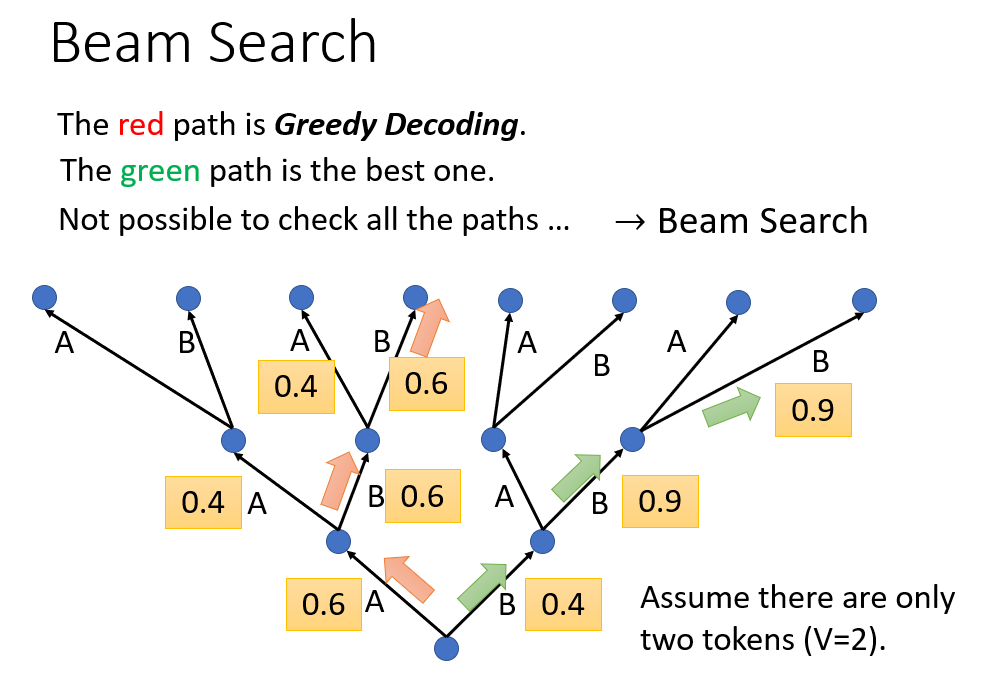

# Transformer

## 结构

## Encoder

+ Add & Norm
    
    利用了 `Residual` 的思想，于此同时加上一个 `Layer Normalization`。
    
    （关于 `Layer Norm` 和 `Batch Norm` 的区别，请看 [NLP中 batch normalization与 layer normalization](https://zhuanlan.zhihu.com/p/74516930) ）
    
    
    
    多头注意力模块 + `Add & Norm` 构成了图中深蓝色的模块，这个模块将会再被用于图中最右的结构。
    
## Decoder

`Decoder` 分为两种：`AT` 和 `NAT`

+ AT

    接受 `Encoder` 的输出，以及自己之前的输出作为输入，反复生成下一个字。
    
    以语音识别为例，输出是一段中文，需要有一个特殊 token 代表开始和结束。
    
    

+ NAT
    
    不同于 `AT` 会一直迭代生成直到输出一个 `END`，`NAT` 是给若干个 `START` 然后并行生成若干个字符。
    
    

## Encoder 和 Decoder 结构对比

+ Decoder 的多头注意力机制模块是 `masked` 的：
    
    未被掩码的 `Self-attention` 会观察整个上下文，但是对于 `decoder` 而言不能观察后文（因为生成一个字的时候，后面的字还未生成，只能获取前文的上下文信息）。
    比如已经生成“机器”的时候，即将生成“学”，模型只能从“机器”这一前文观察到上下文信息，因为此时“习”还没有被生成。
    
    本质上就是输入到 `encoder` 的序列是已知的，可以一窥全文，而 `decoder` 则是循环生成序列，还未生成，何来后文？
    
## Cross Attention

将 `decoder` 的向量的 `q` 和 `encoder` 的向量的 `k` 和 `v` 共同计算 `attention score`，即为 `Cross Attention`。

## Train

+ Teacher Forcing

    在训练 `decoder` 的时候避免 `Error propogation`（一步错步步错），投喂 `Ground truth`。
    
    `decoder` 输出的是一个概率分布，因而使用 `cross entropy` 作为损失函数。
    
    
    
    存在的问题：训练的时候“偷看”了正确结果，但是测试的时候怎么办呢？存在 mismatch。
    
+ Tips

    + Copy Mechanism
    
        应对难以生成或者无需凭空生成（比如生成摘要）序列的情况：
        
        
        
    + Guided Attention
        
        对 Attention 的训练加以限制，比如语音识别的 Attention 必须从左到右：
        
        
        
    + Beam Search
    
        是对 `Greedy Search` 的一个改进算法。相对 `Greedy Search` 扩大了搜索空间，但远远不及穷举搜索指数级的搜索空间，是二者的一个折中方案。
        
        
        
    + 对于语音生成，在测试的时候添加噪音反而会有好的结果：可能是语音的 `ground truth` 不是一个绝对的东西，比如”你好“可能对应男生，女生，中性等多种音调的声音。
        
    + 无法 optimize 的函数（不可微分） 可以考虑用 RL 硬 train？
    
    + 上面提到的 mismatch 问题可以用 `Schedule Sampling` 解决：在 `Teacher Forcing` 的时候投喂一些错误的 `ground truth`，比如`机气学习`
    
        